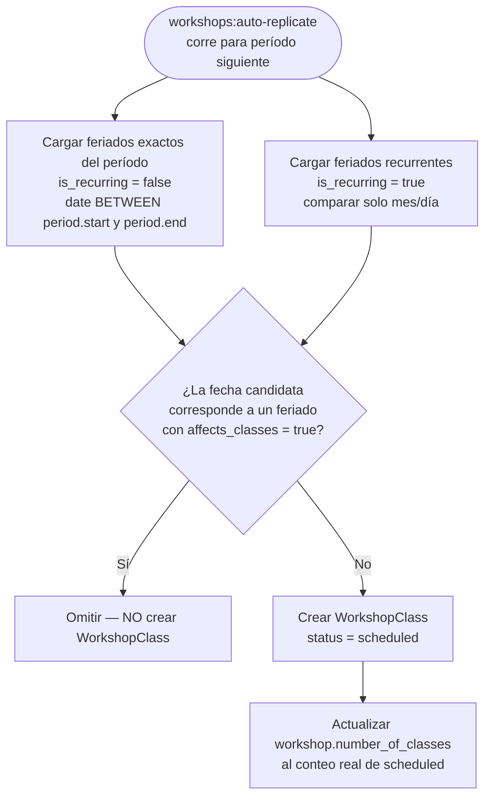
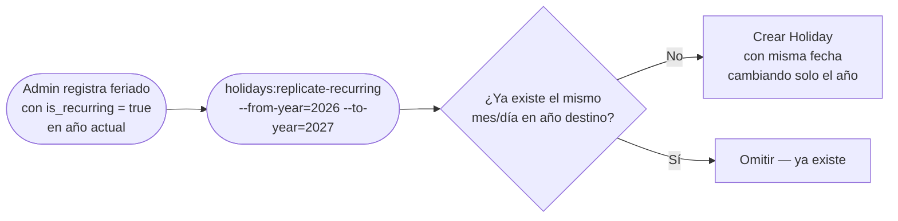

# Módulo: Feriados (Holidays)

> Los feriados controlan qué fechas se excluyen al generar clases de taller. Su impacto es exclusivamente en la fase de **replicación de talleres** — no actúan en tiempo real sobre clases ya creadas.

---

## Modelo de datos

```
holidays
  id
  name              varchar    — nombre descriptivo (ej: "Fiestas Patrias")
  date              date       — fecha exacta del feriado
  is_recurring      boolean    — si se repite el mismo día/mes cada año
  affects_classes   boolean    — si debe cancelar clases al generar el período
  description       varchar    — observaciones opcionales
  created_by        FK → users
  timestamps
```

### Flags clave

| Flag | `true` | `false` |
|------|--------|---------|
| `is_recurring` | Aplica todos los años (mismo mes/día) | Solo el año de la fecha registrada |
| `affects_classes` | Excluye la fecha al generar `WorkshopClass` | Se registra como información pero no cancela clases |

---

## Cuándo aplican los feriados

Los feriados con `affects_classes = true` son leídos **únicamente** por `WorkshopReplicationService` durante la generación de clases del período siguiente:



> **Feriados recurrentes**: se comparan solo por `mes-día`, ignorando el año. Si el feriado del 28 de julio existe como `is_recurring = true`, se excluye el 28 de julio de cualquier año sin necesidad de registrarlo año por año.

---

## Impacto en cadena

```
Holiday registrado con affects_classes = true
  │
  ▼
WorkshopReplicationService (workshops:auto-replicate)
  └─ omite esa fecha al generar WorkshopClass
  └─ workshop.number_of_classes actualizado al conteo real (ej: 3 en vez de 4)
       │
       ▼
  El admin debe ajustar workshop.standard_monthly_fee
  al precio correcto para ese mes con menos clases
  (el sistema NO lo calcula automáticamente)
       │
       ▼
EnrollmentReplicationService (enrollments:auto-generate)
  └─ asigna estudiantes solo a clases scheduled
  └─ precio tomado del workshop.standard_monthly_fee ajustado
  └─ enrollment.number_of_classes = número de clases asignadas
```

### Riesgo si el admin no ajusta el fee

Si `workshop.standard_monthly_fee` no se actualiza antes de que corra `EnrollmentReplicationService`, las inscripciones se crean con la tarifa completa (ej: 60.00) aunque el mes solo tenga 3 clases. No hay validación ni alerta del sistema.

---

## Cuándo NO aplican los feriados

| Escenario | ¿Aplica? | Motivo |
|-----------|----------|--------|
| Feriado registrado después de correr `workshops:auto-replicate` | ❌ | Las `WorkshopClass` ya fueron creadas; el feriado no tiene efecto retroactivo |
| Feriado con `affects_classes = false` | ❌ | Solo es informativo |
| `EnrollmentReplicationService` directamente | ❌ | Solo lee `status` de las `WorkshopClass` existentes, no consulta `holidays` |
| Asistencia / pagos / reportes | ❌ | No consultan la tabla `holidays` |

---

## Acción manual: "Cancelar clases" en el panel

Para feriados registrados **después** de que las clases ya fueron generadas, el panel ofrece el botón **"Cancelar clases"** en el listado de feriados:

- Muestra todas las `WorkshopClass` con `class_date = holiday.date` y `status != cancelled`
- Cambia su `status` a `cancelled` en una sola operación
- Visible solo si `holiday.affects_classes = true` y existen clases no canceladas en esa fecha

**Este es el flujo correcto cuando un feriado surge de improvisto** (suspensión puntual, emergencia) después de que el mes ya fue generado.

---

## Feriados recurrentes — gestión anual



Comando:
```bash
php artisan holidays:replicate-recurring
php artisan holidays:replicate-recurring --from-year=2026 --to-year=2027
```

Feriados recurrentes deben replicarse **antes** de que corra `workshops:auto-replicate` para el año destino, de lo contrario el año destino no los verá durante la generación de clases.

---

## Orden correcto de operaciones al inicio de un nuevo período

```
1. holidays:replicate-recurring        ← proyectar feriados del año siguiente
2. (revisar y corregir fechas en el panel si hay feriados movibles, ej: Semana Santa)
3. workshops:auto-replicate            ← genera talleres y clases; excluye feriados
4. (admin ajusta workshop.standard_monthly_fee para talleres con clases reducidas)
5. (admin cancela manualmente clases por suspensiones no registradas como feriado)
6. enrollments:auto-generate --force  ← replica inscripciones a clases scheduled
```

---

## Bug conocido — Doble descuento en replicación de inscripciones

**Resuelto en 2026-06-23** (`fix_july_2026_enrollment_prices_double_discount`).

La lógica original en `EnrollmentReplicationService` detectaba `workshop.number_of_classes < workshopTemplate.number_of_classes` e interpretaba ese mes como "mes con feriado" → aplicaba `standard_monthly_fee / templateClasses × surcharge × actualClasses`.

El problema: el admin ya había ajustado `standard_monthly_fee` al precio reducido (ej: 45.00 en vez de 60.00). La fórmula lo dividía nuevamente por `templateClasses (4)`, causando un segundo descuento:

```
Incorrecto: 45.00 / 4 × 1.20 × 3 = 40.50
Correcto:   45.00 × 1.0           = 45.00
```

**Fix**: `EnrollmentReplicationService` usa siempre tarifa flat — `standard_monthly_fee × inscription_multiplier`. El fee del taller mensual es la fuente de verdad del precio; si hubo feriados, el admin ya lo ajustó.

---

## Archivos clave

| Archivo | Responsabilidad |
|---------|----------------|
| `app/Models/Holiday.php` | Modelo; boot auto-asigna `created_by` |
| `app/Filament/Resources/HolidayResource.php` | CRUD + acción "Cancelar clases" |
| `app/Console/Commands/ReplicateRecurringHolidays.php` | Proyecta feriados recurrentes al año siguiente |
| `app/Services/WorkshopReplicationService.php` | Único consumidor de `Holiday` en automatizaciones |
