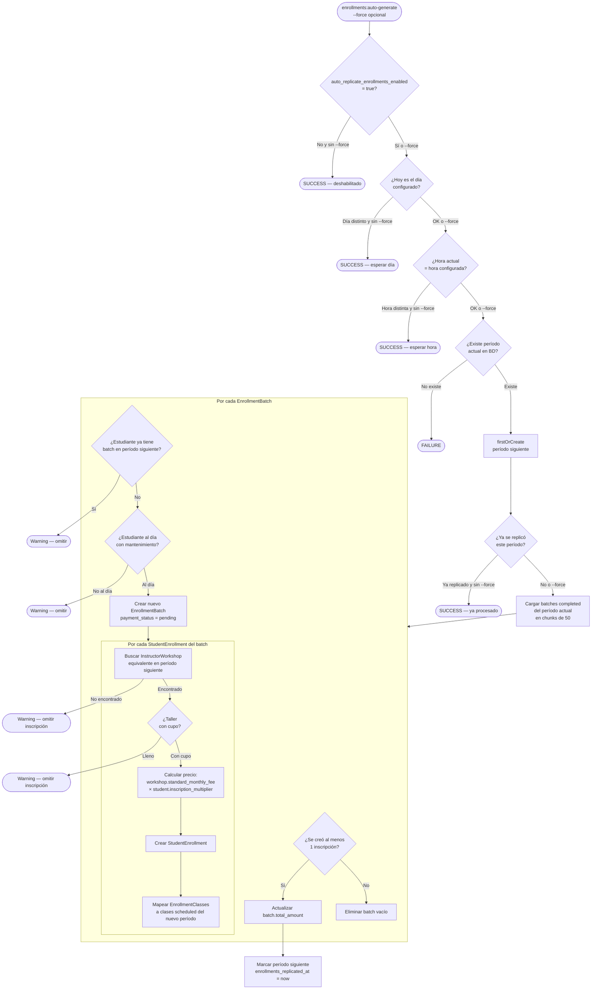
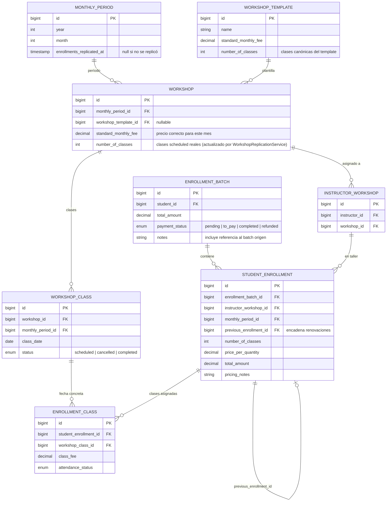

# Flujo: Replicación Automática de Inscripciones

> Proceso que replica las inscripciones del mes actual al siguiente período para estudiantes con lote `completed`.
> Comando: `enrollments:auto-generate` — actualmente deshabilitado en el scheduler; se ejecuta manualmente.

---

## Prerrequisito obligatorio

**La replicación de talleres debe correr ANTES que este proceso.**

```
WorkshopReplicationService (workshops:auto-replicate)
  └── genera workshop_classes para el período siguiente
      └── marca como cancelled las que caen en feriado (Holiday.affects_classes = true)

        ↓  El admin revisa y cancela manualmente suspensiones no registradas como feriado

EnrollmentReplicationService (enrollments:auto-generate)
  └── asigna estudiantes SOLO a clases con status = 'scheduled'
```

Si `EnrollmentReplicationService` corre antes, no encuentra `WorkshopClass` del período siguiente y falla al asignar clases.

---

## Flujo general



---

## Cálculo de precio

El precio de cada `StudentEnrollment` replicado se calcula con la tarifa del taller del **período siguiente** (no se copia la tarifa original):

```
finalPrice = workshop.standard_monthly_fee × student.inscription_multiplier
```

| Campo | Fuente |
|-------|--------|
| `workshop.standard_monthly_fee` | Taller del período siguiente (ya ajustado por el admin si hay feriados) |
| `student.inscription_multiplier` | Según `category_partner`: PRE PAMA 50+ → 2.0 · PRE PAMA 55+ → 1.5 · resto → 1.0 |

### Por qué tarifa flat (sin rama holiday)

Cuando `WorkshopReplicationService` replica un taller a un mes con feriados, actualiza `workshop.number_of_classes` al conteo real de clases `scheduled`. El admin luego ajusta `workshop.standard_monthly_fee` para reflejar el precio correcto del mes (ej: 3/4 del precio normal si hay un feriado que deja 3 clases de 4).

El servicio de replicación de inscripciones usa ese fee **ya ajustado** directamente. Aplicar además una fórmula de recargo causaría doble descuento.

**Bug corregido (2026-06-23, migración `fix_july_2026_enrollment_prices_double_discount`):**
Existía una rama "holiday" que aplicaba `standard_monthly_fee / templateClasses × surcharge × actualClasses` cuando `workshop.number_of_classes < workshopTemplate.number_of_classes`. Esto dividía un fee ya reducido por el admin entre las clases del template (4), resultando en un precio menor al correcto. Ejemplo: ACTIVIDAD FISICA → `18.75 / 4 × 1.2 × 3 = 16.88` en lugar de `18.75`.

---

## Búsqueda del InstructorWorkshop equivalente

El sistema no usa IDs directos para localizar el taller del período siguiente. Construye una clave compuesta:

```
{instructor_id}_{workshop.name}_{day_of_week}_{start_time}_{duration}_{modality}
```

Los `InstructorWorkshop` del período siguiente se pre-cargan en memoria al inicio (evita N+1). Si no existe match exacto, la inscripción se omite con warning en el log.

---

## Mapeo de clases (EnrollmentClass)

| Tipo de inscripción | Comportamiento |
|---------------------|---------------|
| `full_month` | Se asigna a **todas** las `WorkshopClass` con `status = 'scheduled'` del nuevo período, hasta `number_of_classes` |
| `specific_classes` | Se intenta mapear cada clase original a su equivalente: mismo día de semana + mismo `start_time` + mismo `end_time`, excluyendo clases ya usadas |

Solo se asignan clases con `status != 'cancelled'`. Los feriados ya fueron marcados como `cancelled` por `WorkshopReplicationService`.

---

## Reglas de omisión

| Condición | Resultado |
|-----------|-----------|
| Estudiante ya tiene batch activo en período siguiente (creado manualmente) | Batch omitido — warning |
| Estudiante no está al día con mantenimiento | Batch omitido — warning |
| Taller equivalente no existe en período siguiente | Inscripción omitida — warning |
| Taller lleno (`isFullForPeriod`) | Inscripción omitida — warning |
| Ninguna inscripción se creó para un batch | Batch vacío eliminado |

El método `validateStudentEligibility` delega a `Student::isMaintenanceCurrent()`, que contempla:
- Categorías exoneradas (Vitalicios, Hijo de Fundador, Transitorio Mayor de 75): siempre elegibles
- Período de gracia de 2 meses para las demás categorías

---

## Protección contra duplicados entre batches del mismo estudiante

Un estudiante puede tener **múltiples batches** replicados en el mismo período (si en el mes origen tenía múltiples batches). El servicio mantiene `$createdBatchIdsByStudent` en memoria para excluir los batches que él mismo creó en la ejecución actual, evitando falsos positivos en la validación de duplicados.

---

## Modelo de datos



---

## Archivos clave

| Archivo | Responsabilidad |
|---------|----------------|
| `app/Console/Commands/AutoGenerateNextMonthEnrollments.php` | Comando artisan; valida día/hora/feature flag antes de delegar al servicio |
| `app/Services/EnrollmentReplicationService.php` | Lógica principal: búsqueda de batches, cálculo de precio, creación de enrollments y enrollment classes |
| `app/Services/WorkshopReplicationService.php` | Debe correr primero; genera `workshop_classes` y actualiza `number_of_classes` |
| `app/Models/MonthlyPeriod.php` | Contiene `enrollments_replicated_at` (lock de idempotencia) |
| `app/Models/Workshop.php` | `standard_monthly_fee` y `number_of_classes` son la fuente de verdad del precio mensual |
| `app/Models/WorkshopTemplate.php` | `number_of_classes` canónico (referencia histórica, no determina el precio en replicación) |
| `app/Models/Student.php` | `inscription_multiplier`, `isMaintenanceCurrent()` |

---

## Ejecución manual

```bash
# Verificar sin ejecutar (dry-run no disponible — revisar logs post-ejecución)
php artisan enrollments:auto-generate --force

# Ver resultado en logs
php artisan pail
```

El flag `--force` omite validaciones de día/hora y el lock `enrollments_replicated_at`. Muestra advertencia si ya se ejecutó para el período.
