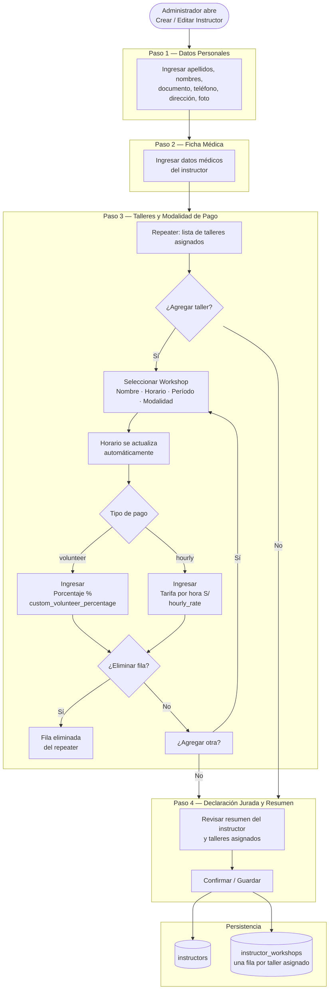
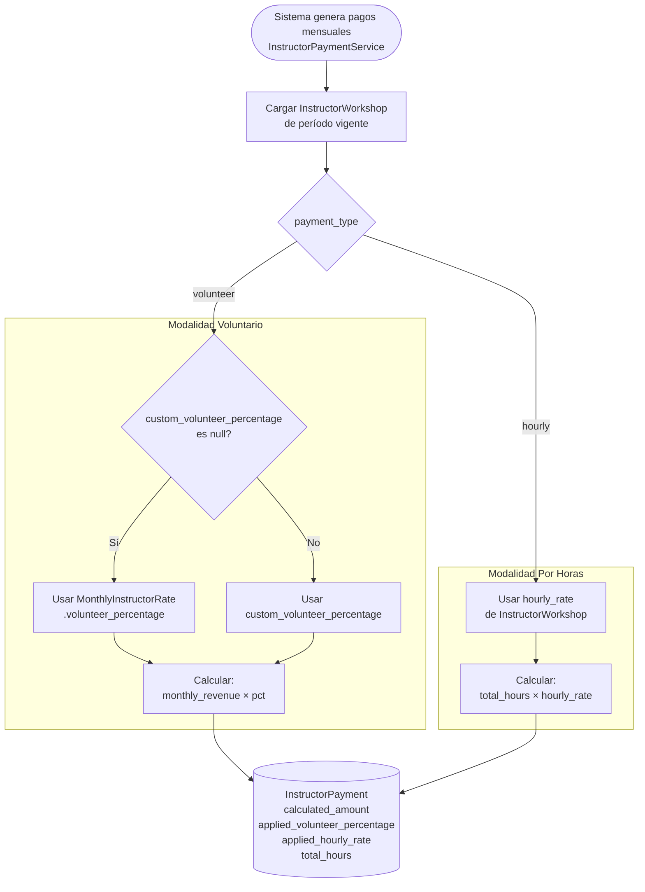
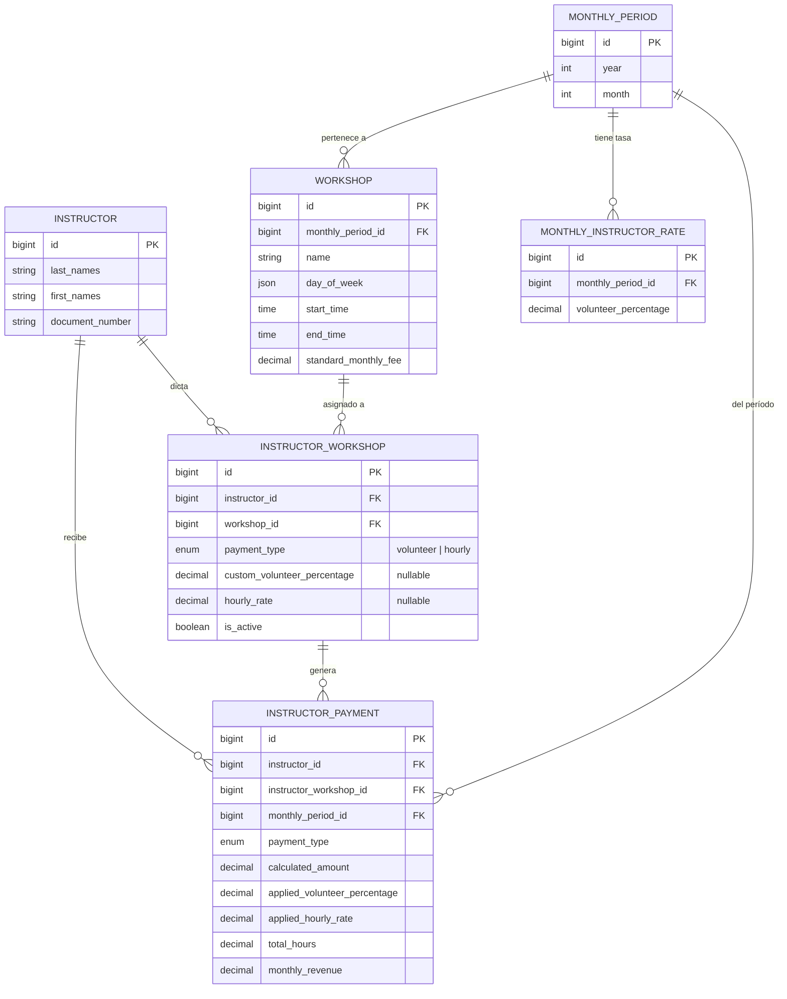

# Flujo: Creación / Edición de Instructor

> Wizard de 4 pasos para registrar o modificar un instructor y sus talleres asignados.

---

## Flujo General del Wizard

---

## Lógica de Cálculo de Pago (posterior al wizard)

---

## Modelo de Datos Involucrado

---

## Archivos Clave

| Archivo | Responsabilidad |
|---------|----------------|
| `app/Filament/Resources/InstructorResource.php` | Wizard y form schema (pasos 1–4) |
| `app/Models/Instructor.php` | Modelo principal, relaciones |
| `app/Models/InstructorWorkshop.php` | Junction; lógica `getEffectiveVolunteerPercentage()` |
| `app/Models/Workshop.php` | Taller base con horario y precio |
| `app/Models/InstructorPayment.php` | Pago mensual generado |
| `app/Services/InstructorPaymentService.php` | Cálculo de pagos volunteer/hourly |
| `app/Models/MonthlyInstructorRate.php` | Porcentaje mensual por defecto |
