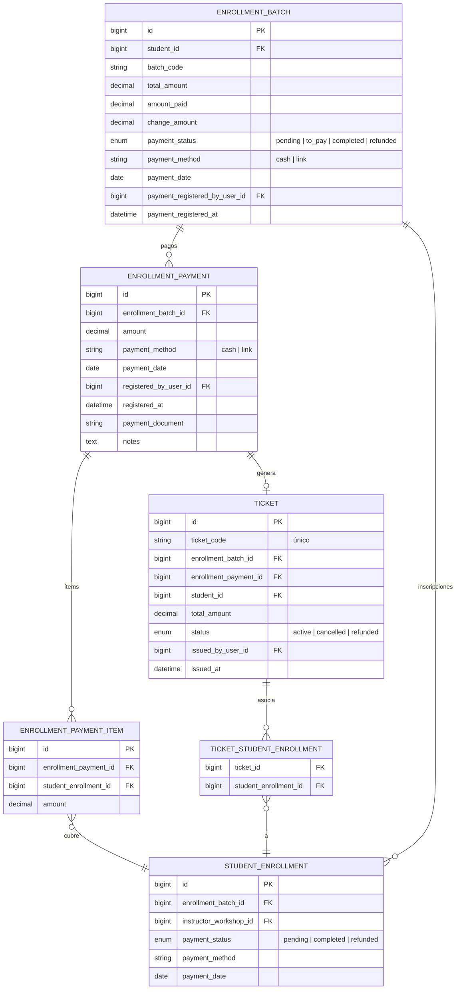

# Flujo: Pago Total de Inscripción

> Proceso que registra el cobro completo de todas las inscripciones de un lote en una sola transacción.
> Entry point: botón **"Cobrar"** en la tabla de `EnrollmentBatch`.

---

## Métodos de pago

| Método | Descripción | Código de ticket generado |
|--------|-------------|--------------------------|
| **Efectivo (cash)** | El cajero recibe dinero en mano, ingresa monto cobrado | `{enrollment_code}-{seq-6-dígitos}` |
| **Transferencia (link)** | Pago por transferencia bancaria o Yape/Plin, cajero confirma con código de voucher | `{enrollment_code}-{codigo_voucher}` |

---

## Flujo general

```mermaid
flowchart TD
    OPEN([Usuario abre modal\n"Cobrar" en EnrollmentBatch])

    METHOD{Método\nde pago}

    subgraph LINK_FORM["Formulario LINK"]
        L1[Ingresa batch_code\nvoucher del banco/app]
        L2[Ingresa payment_date]
        L3[Notas opcionales]
    end

    subgraph CASH_FORM["Formulario CASH"]
        C1[Visualiza inscripciones\npendientes del lote]
        C2[Selecciona TODAS\npara pago total]
        C3[Ingresa amount_paid\nmonto recibido]
        C4[Sistema calcula change_amount\nvuelto en tiempo real]
        C5[Ingresa payment_date]
    end

    VALIDATE_CASH{amount_paid\n≥ total_amount?}
    ERR_AMOUNT([Error: monto insuficiente\nNotificación al usuario])

    GET_PENDING[getPendingEnrollments\nfiltra cancelled_at IS NULL\npayment_status = pending]

    subgraph TX["DB Transaction"]
        CREATE_PAYMENT[Crear EnrollmentPayment\nregistered_by_user_id = Auth::id]
        CREATE_ITEMS[Crear EnrollmentPaymentItem\npor cada enrollment seleccionado]
        UPDATE_ENROLL[StudentEnrollment.payment_status\n→ completed\npor cada enrollment]
        GEN_CODE{Método?}
        GEN_CASH_CODE["Ticket code:\n{enrollment_code}-{seq-6-dígitos}\n(cuenta tickets cash del usuario)"]
        GEN_LINK_CODE["Ticket code:\n{enrollment_code}-{batch_code_manual}"]
        CREATE_TICKET[Crear Ticket\nstatus = active\nissued_by_user_id = Auth::id]
        ATTACH_TICKET[Adjuntar ticket a enrollments\nvía pivot ticket_student_enrollment]
        UPDATE_STATUS[updateBatchStatus\nbatch.payment_status → completed]
    end

    NOTIFY([Notificación éxito\nModal actualizado])

    OPEN --> METHOD
    METHOD -->|link| LINK_FORM
    METHOD -->|cash| CASH_FORM

    LINK_FORM --> GET_PENDING
    CASH_FORM --> VALIDATE_CASH
    VALIDATE_CASH -->|No| ERR_AMOUNT
    VALIDATE_CASH -->|Sí| GET_PENDING

    GET_PENDING --> TX

    CREATE_PAYMENT --> CREATE_ITEMS
    CREATE_ITEMS --> UPDATE_ENROLL
    UPDATE_ENROLL --> GEN_CODE
    GEN_CODE -->|cash| GEN_CASH_CODE
    GEN_CODE -->|link| GEN_LINK_CODE
    GEN_CASH_CODE --> CREATE_TICKET
    GEN_LINK_CODE --> CREATE_TICKET
    CREATE_TICKET --> ATTACH_TICKET
    ATTACH_TICKET --> UPDATE_STATUS

    TX --> NOTIFY
```

---

## Reglas de negocio

| # | Regla | Dónde se aplica |
|---|-------|----------------|
| 1 | Solo se pueden pagar enrollments con `payment_status = 'pending'` y `cancelled_at IS NULL` | `getPendingEnrollments()` — `EnrollmentPaymentService:136` |
| 2 | El monto ingresado (cash) debe ser ≥ `total_amount` del lote; la diferencia es el vuelto (`change_amount`) | `RegisterPaymentAction:347-360` |
| 3 | Toda la operación corre dentro de una **DB transaction** — si falla cualquier paso, no se persiste nada | `EnrollmentPaymentService:14` |
| 4 | Se genera **un solo ticket** por transacción de pago (no uno por enrollment) | `EnrollmentPaymentService:60-90` |
| 5 | El código de ticket **cash** es secuencial por usuario: cuenta únicamente los tickets con `payment_method = 'cash'` del mismo user | `generateTicketCode()` — `EnrollmentPaymentService:153` |
| 6 | El código de ticket **link** embebe el `batch_code` del voucher ingresado manualmente por el cajero | `generateTicketCodeForLink()` — `EnrollmentPaymentService:189` |
| 7 | La validación de monto usa tolerancia de `0.01` para evitar errores de redondeo float | `validatePaymentAmount()` — `EnrollmentPaymentService:145` |
| 8 | El botón "Cobrar" se oculta automáticamente si `payment_status = 'completed'` o no quedan enrollments pendientes | `RegisterPaymentAction:435-438` |

---

## Transición de estados

```
EnrollmentBatch:
  pending ──(processPayment: todos los enrollments)──> completed

StudentEnrollment (cada uno):
  pending ──(processPayment)──> completed

Ticket:
  [nuevo] active
```

---

## Generación del ticket

### Formato CASH
```
{user.enrollment_code} - {secuencia 6 dígitos con cero-padding}

Ejemplo: 002-000019
         ^^^         enrollment_code del cajero (3 dígitos)
             ^^^^^^  número secuencial de tickets cash del cajero
```

La secuencia **no es global** — es por cajero. Se calcula contando los tickets existentes con `payment_method = 'cash'` del mismo usuario, luego `+ 1`.

### Formato LINK
```
{user.enrollment_code} - {batch_code ingresado manualmente}

Ejemplo: 002-YAP-20250430
         ^^^              enrollment_code del cajero
             ^^^^^^^^^^^^ código de voucher que el cajero tipea
```

---

## Modelo de datos



---

## Archivos clave

| Archivo | Responsabilidad |
|---------|----------------|
| `app/Filament/Resources/EnrollmentBatchResource/Actions/RegisterPaymentAction.php` | Form UI cash/link; handler que valida y llama al servicio |
| `app/Services/EnrollmentPaymentService.php` | `processPayment()` (transacción), `updateBatchStatus()`, `generateTicketCode()`, `generateTicketCodeForLink()` |
| `app/Models/EnrollmentBatch.php` | Estado del lote; accessors `total_paid`, `balance_pending` |
| `app/Models/EnrollmentPayment.php` | Registro de cada transacción; auto-asigna `registered_by_user_id` |
| `app/Models/EnrollmentPaymentItem.php` | Pivot payment ↔ enrollment |
| `app/Models/StudentEnrollment.php` | Estado individual de cada inscripción |
| `app/Models/Ticket.php` | Comprobante; auto-asigna `issued_by_user_id` y `issued_at` |
| `app/Http/Controllers/StudentEnrollmentController.php` | Genera PDF del ticket vía Dompdf |
| `resources/views/pdfs/ticket_pdf.blade.php` | Plantilla PDF del ticket (A5, con grilla de horario) |
| `resources/views/filament/modals/tickets-list.blade.php` | Modal que lista tickets del lote con botón descargar PDF |
| `routes/web.php:17` | `POST /ticket/{ticket}/pdf` → `generateTicketPdf` |
