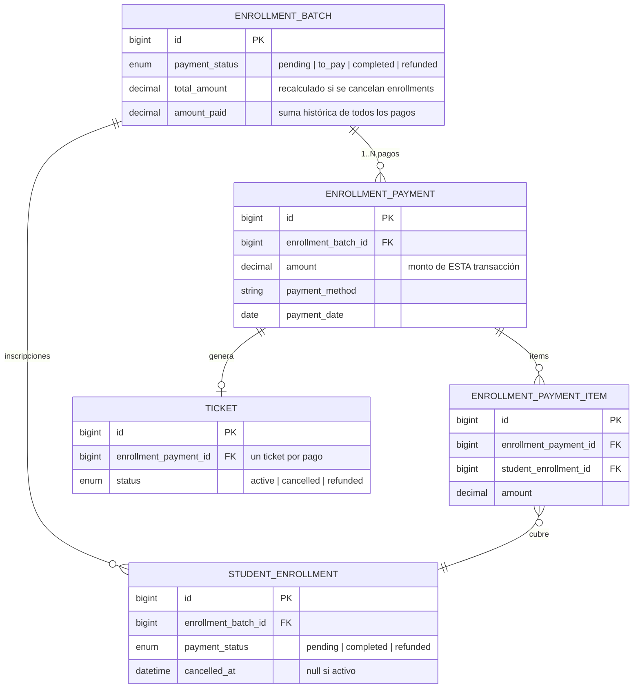

# Flujo: Pago Parcial de Inscripción

> Proceso donde el estudiante paga solo una parte de las inscripciones del lote.
> El lote queda en estado `to_pay` — protegido de la auto-cancelación automática.

---

## Diferencia con pago total

En el formulario **cash**, el cajero puede seleccionar un **subconjunto** de inscripciones pendientes del lote en lugar de todas. Esto crea un pago parcial y activa la protección del lote.

El formulario **link** siempre procesa **todas** las inscripciones pendientes — no admite pagos parciales.

---

## Flujo general

```mermaid
flowchart TD
    OPEN([Usuario abre modal "Cobrar"\nCASH únicamente])

    SHOW_PENDING[CheckboxList muestra\ntodos los enrollments pendientes]
    SELECT_PARTIAL[Cajero selecciona\nsubconjunto de inscripciones]
    VALIDATE{amount_paid ≥\ntotal del subconjunto?}
    ERR([Error: monto insuficiente])

    subgraph TX1["DB Transaction — 1er pago"]
        P1_PAYMENT[Crear EnrollmentPayment\ncon monto parcial]
        P1_ITEMS[Crear EnrollmentPaymentItem\npor enrollments seleccionados]
        P1_ENROLL[StudentEnrollment seleccionados\npayment_status → completed]
        P1_TICKET[Generar Ticket\ncon código cash secuencial]
        P1_STATUS[updateBatchStatus\ndetecta: algunos completed, algunos pending\nbatch.payment_status → to_pay]
    end

    TO_PAY_STATE[Lote en estado to_pay\n✓ Protegido de auto-cancel global\n✗ Enrollments pending aún vulnerables]

    NEXT_ACTION{¿Qué ocurre\nen el lote?}

    subgraph TX2["DB Transaction — 2do pago (complementario)"]
        P2_SELECT[Cajero vuelve y paga\nlos enrollments restantes]
        P2_PAYMENT[Crear 2do EnrollmentPayment]
        P2_ITEMS[Crear EnrollmentPaymentItem\npor enrollments restantes]
        P2_ENROLL[Enrollments restantes\npayment_status → completed]
        P2_TICKET[Generar 2do Ticket]
        P2_STATUS[updateBatchStatus\ntodos completed → batch = completed]
    end

    subgraph AUTO_CANCEL["Auto-cancel día configurado"]
        AC_STRATEGY2[cancelUnpaidEnrollmentsInPartialBatches\nidentifica lotes to_pay con enrollments pending]
        AC_CANCEL[Cancela SOLO enrollments pending\ncancelled_at = now, payment_status = refunded]
        AC_RECALC[Recalcula batch.total_amount\n= suma enrollments NO cancelados]
        AC_AUDIT[Agrega nota de auditoría\ncon talleres cancelados y nuevo total]
        AC_STATUS[updateBatchStatus\nlote puede quedar completed o to_pay\nsegún enrollments que quedan]
    end

    subgraph MANUAL_CANCEL["Cancelación manual de enrollments pendientes"]
        MC_ACTION[Acción cancel_pending_enrollments\nvisible solo si batch = to_pay\ny hay enrollments pending]
        MC_AUTH{Usuario\nautorizado?}
        MC_SELECT[Cajero selecciona\nenrollments a cancelar]
        MC_CANCEL[Marca enrollments\npayment_status = refunded\ncancelled_at = now]
        MC_RECALC[Recalcula batch.total_amount]
        MC_STATUS[updateBatchStatus]
        MC_ERR([Notificación: sin autorización])
    end

    DONE_COMPLETE([Lote completed])
    DONE_PARTIAL([Lote to_pay\ncon algunos enrollments cancelados])

    OPEN --> SHOW_PENDING
    SHOW_PENDING --> SELECT_PARTIAL
    SELECT_PARTIAL --> VALIDATE
    VALIDATE -->|No| ERR
    VALIDATE -->|Sí| TX1

    P1_PAYMENT --> P1_ITEMS --> P1_ENROLL --> P1_TICKET --> P1_STATUS

    TX1 --> TO_PAY_STATE
    TO_PAY_STATE --> NEXT_ACTION

    NEXT_ACTION -->|Pago complementario| TX2
    P2_SELECT --> P2_PAYMENT --> P2_ITEMS --> P2_ENROLL --> P2_TICKET --> P2_STATUS
    P2_STATUS --> DONE_COMPLETE

    NEXT_ACTION -->|Día de auto-cancel| AUTO_CANCEL
    AC_STRATEGY2 --> AC_CANCEL --> AC_RECALC --> AC_AUDIT --> AC_STATUS
    AC_STATUS --> DONE_COMPLETE
    AC_STATUS --> DONE_PARTIAL

    NEXT_ACTION -->|Admin cancela manualmente| MANUAL_CANCEL
    MC_ACTION --> MC_AUTH
    MC_AUTH -->|No| MC_ERR
    MC_AUTH -->|Sí| MC_SELECT
    MC_SELECT --> MC_CANCEL --> MC_RECALC --> MC_STATUS
    MC_STATUS --> DONE_COMPLETE
    MC_STATUS --> DONE_PARTIAL
```

---

## Reglas de negocio

| # | Regla | Dónde se aplica |
|---|-------|----------------|
| 1 | `payment_status = 'to_pay'` se asigna automáticamente cuando ≥1 enrollment está `completed` pero el lote aún tiene enrollments `pending` | `updateBatchStatus()` — `EnrollmentPaymentService:98` |
| 2 | Lotes `'to_pay'` **nunca** son auto-cancelados globalmente — la estrategia `cancelPendingBatches` solo ataca lotes `'pending'` | `AutoCancelPendingEnrollments:80-147` |
| 3 | El día de auto-cancel, `cancelUnpaidEnrollmentsInPartialBatches()` **sí cancela** los enrollments `pending` dentro de lotes `'to_pay'`; el lote en sí no desaparece | `AutoCancelPendingEnrollments:153-243` |
| 4 | Tras cancelar enrollments pendientes, se **recalcula `batch.total_amount`** = suma de enrollments no cancelados | `AutoCancelPendingEnrollments:208` |
| 5 | Después de la recalculación, se llama `updateBatchStatus()` — el lote puede quedar `'completed'` si todos los restantes están pagados | `EnrollmentPaymentService:98` |
| 6 | La acción manual `cancel_pending_enrollments` solo aparece en lotes con `payment_status = 'to_pay'` que tengan enrollments pendientes | `EnrollmentBatchResource:643-755` |
| 7 | La autorización para cancelación manual es una **whitelist hardcoded** de nombres de usuario en el Resource — no usa Policies ni Spatie Permissions | `EnrollmentBatchResource:554-566` |
| 8 | La acción manual `cancel_enrollment` (lote completo) solo aplica a lotes `'pending'` o `'completed'` — **no** a lotes `'to_pay'` | `EnrollmentBatchResource:530-642` |
| 9 | Múltiples `EnrollmentPayment` pueden existir por batch — uno por cada transacción parcial; no hay límite | `EnrollmentBatch::payments()` HasMany |
| 10 | El pago parcial **no puede ser link** — el formulario link procesa siempre todos los enrollments pendientes | `RegisterPaymentAction:285-329` |

---

## Tabla de transiciones de estado

### `EnrollmentBatch.payment_status`

| Estado origen | Evento | Estado destino | Descripción |
|--------------|--------|----------------|-------------|
| `pending` | Primer pago parcial (subset) | `to_pay` | Al menos un enrollment pagado, otros siguen pendientes |
| `pending` | Pago total (todos) | `completed` | Todos los enrollments pagados en una transacción |
| `pending` | Auto-cancel día 28 | `refunded` | Sin ningún pago registrado al vencer el plazo |
| `to_pay` | Pago complementario completa todos | `completed` | Todos los enrollments pagados (en múltiples transacciones) |
| `to_pay` | Auto-cancel cancela pendientes, todos los restantes ya pagados | `completed` | Los pendientes se refundan; los pagados permanecen |
| `to_pay` | Auto-cancel cancela pendientes, aún quedan pagados sin completar | `to_pay` | Sigue parcialmente pagado |
| `completed` | Cancelación manual de admin | `refunded` | Reversión completa (requiere autorización) |

### `StudentEnrollment.payment_status`

| Estado origen | Evento | Estado destino |
|--------------|--------|----------------|
| `pending` | Incluido en `processPayment()` | `completed` |
| `pending` | Auto-cancel (lote pending) | `refunded` |
| `pending` | `cancelUnpaidEnrollmentsInPartialBatches` | `refunded` |
| `pending` | Cancelación manual `cancel_pending_enrollments` | `refunded` |

---

## Protección auto-cancel: por qué `to_pay` ≠ `pending`

El campo `payment_status` del lote es la **única barrera** entre un lote con pago parcial y la auto-cancelación masiva del día 28.

```
Día 28 — AutoCancelPendingEnrollments corre:

  Estrategia 1: cancelPendingBatches()
    └── WHERE payment_status = 'pending'
        └── Cancela TODO el lote (batch + enrollments + tickets)
        └── batch.payment_status → 'refunded'

  Estrategia 2: cancelUnpaidEnrollmentsInPartialBatches()
    └── WHERE payment_status = 'to_pay'
        └── Solo cancela enrollments con payment_status = 'pending'
        └── Enrollments ya pagados NO se tocan
        └── Recalcula batch.total_amount
        └── Llama updateBatchStatus()
```

Un lote con `payment_status = 'to_pay'` **sobrevive** la Estrategia 1 y solo pierde sus enrollments no pagados en la Estrategia 2. Los enrollments ya pagados y sus tickets permanecen intactos.

**Consecuencia operacional:** Cualquier lote con pago parcial (`to_pay`) requiere seguimiento manual. El sistema no los elimina, pero tampoco los cobra automáticamente.

---

## Modelo de datos (múltiples pagos por lote)



*Un batch con pago parcial tendrá ≥2 `EnrollmentPayment` cuando se completa en múltiples transacciones.*

---

## Archivos clave

| Archivo | Responsabilidad |
|---------|----------------|
| `app/Filament/Resources/EnrollmentBatchResource/Actions/RegisterPaymentAction.php:166-220` | CheckboxList para seleccionar enrollments en pago parcial |
| `app/Services/EnrollmentPaymentService.php:98-134` | `updateBatchStatus()` — determina si batch queda `to_pay` o `completed` |
| `app/Services/EnrollmentPaymentService.php:136-143` | `getPendingEnrollments()` — filtra los pagables en cada vuelta |
| `app/Console/Commands/AutoCancelPendingEnrollments.php:80-147` | Estrategia 1: cancela lotes `pending` completos |
| `app/Console/Commands/AutoCancelPendingEnrollments.php:153-243` | Estrategia 2: cancela enrollments `pending` dentro de lotes `to_pay` |
| `app/Filament/Resources/EnrollmentBatchResource.php:643-755` | Acción manual `cancel_pending_enrollments` (requiere usuario autorizado) |
| `app/Filament/Resources/EnrollmentBatchResource.php:530-642` | Acción manual `cancel_enrollment` (solo para lotes `pending`/`completed`) |
| `app/Models/EnrollmentBatch.php:166-177` | Accessors `total_paid`, `balance_pending`, `hasPartialPayments()` |
