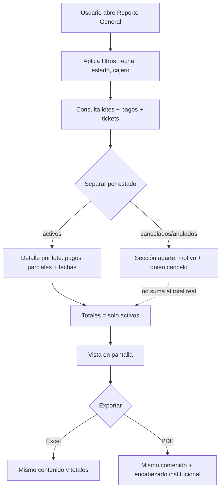
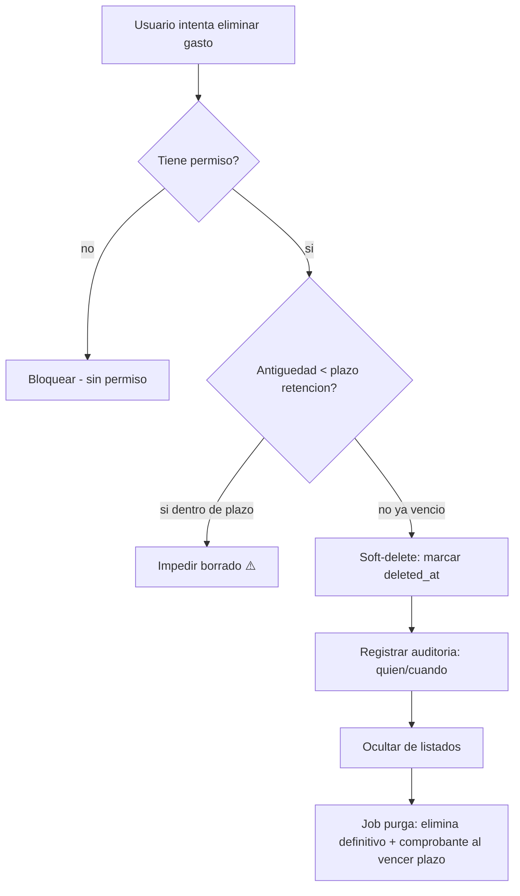
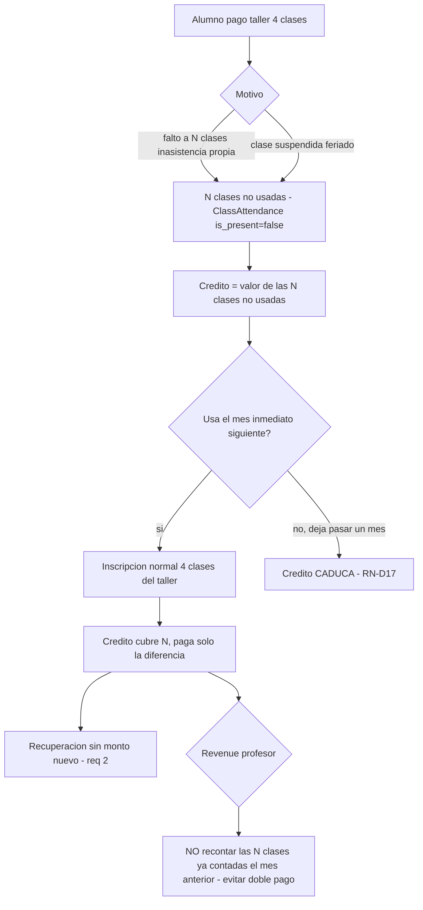
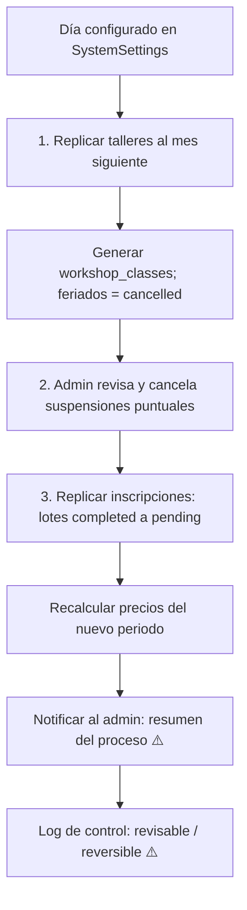
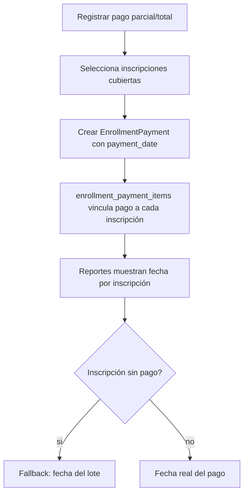

# Nuevos Requerimientos — Épicas, Flujos y Criterios de Aceptación

> **Propósito:** documento de trabajo del Product Owner para presentar al cliente. Cada épica incluye: estado actual (verificado en código), preguntas de definición, **flujo dibujado** (diagrama), **reglas de negocio** y **criterios de aceptación**.
>
> **Fecha:** 2026-07-02 · **Estado:** pendiente de validación con el cliente (Susana / PAMA).
>
> **Cómo leer los diagramas:** están en formato Mermaid (se renderizan en GitHub, VS Code con extensión Mermaid, y visores Markdown modernos). Para la reunión con el cliente pueden exportarse a imagen.
>
> **Nota:** las reglas y criterios marcados con **⚠️ (supuesto)** dependen de una decisión aún abierta; se confirman en la reunión y luego se fijan.

---

## Mapa de épicas y orden de desarrollo

| Orden | Épica | Reqs (orig.) | Depende de | Por qué se agrupan |
|-------|-------|--------------|------------|--------------------|
| 1º | **A. Motor de "dinero real"** | 1, 9, 10, 11 | — | Todos dependen de una única definición: ¿qué monto cuenta (pagado vs. inscrito)? Tocan revenue, pago a profesores y totales. **Resolver primero.** |
| 2º | **C. Tickets y recibos** | 3, 5 | — | Numeración correlativa + retención/borrado. Independiente, paralelizable. |
| 3º | **D. Inscripciones** | 2, 6, 7 + anulación/crédito/recuperación | parcial A | Recuperaciones, crédito a favor, anulación, automatización, fechas de pago. Define cómo se mueve el dinero (crédito) que luego los reportes deben cuadrar. |
| 4º | **B. Reportes (visualización/export)** | 4, 8 | A, C, D | **Se cierra al final.** Los reportes consumen los montos y el flujo de crédito/recuperación definidos en A y D; hacerlos antes obliga a retrabajo para cuadrar la información. |

> **Decisión transversal — RESUELTA (criterio dual):** *"dinero real = solo `completed`"*, con distinto nivel según el reporte:
> - **Recaudación** (general, horario, caja): filtro por **lote** — solo lotes `completed`; parciales/impagos excluidos y no visibles.
> - **Pago a profesores**: filtro por **inscripción** — cada inscripción `completed` cuenta para su taller, aunque el lote sea parcial. Solo cobrado; sin recálculo retroactivo.
>
> **⚠️ Aclaración de estados (etiquetas reales del sistema — `EnrollmentBatch.php:128`):**
> | Estado (código) | Etiqueta UI | Significado | ¿Dinero cobrado? |
> |-----------------|-------------|-------------|------------------|
> | `pending` | **En Proceso** | Cero pagos; sujeto a auto-cancelación | ❌ No |
> | `to_pay` | **Por Pagar** | Pago **parcial** hecho; protegido de auto-cancel | ⚠️ Sí, parcial |
> | `completed` | Completado | Pagado 100% | ✅ Sí |
> | `refunded` | Anulado | Cancelado/devuelto | ❌ No |
>
> **Cuidado con la terminología del cliente:** en el req. original *"los que no han pagado o en proceso"* — en este sistema **"no han pagado" = "En Proceso" = `pending`** (son lo mismo, cero pagos). El pago **parcial** se llama **"Por Pagar"** (`to_pay`) y sí tiene dinero real. Confirmar con el cliente si quiere excluir también los parciales.

---

# ÉPICA A — Motor de "dinero real"

**Reqs:** 1 (validación pago profesores), 9 (total por horario), 10 (excluir no pagados), 11 (pago profesores tesorería).

**Estado actual (código):**
- `ScheduleEnrollmentReport.php:164` filtra solo `whereNotIn(payment_status,['refunded'])` → **incluye pendientes y parciales** en el total.
- `InstructorPaymentService.php:118-123` (`getWorkshopRevenueForPeriod`) suma `total_amount` de **todas** las inscripciones, **sin filtrar estado de pago**.
- `MonthlyInstructorReport.php:100-123` carga estados `['completed','pending']`.
- `InstructorPayment.php:26` (`instructor_payment_receipt_id`) → hoy **un recibo por todo el horario** (`InstructorPaymentResource.php:197-236`).

**✅ Decisiones confirmadas (reunión):**

| # | Pregunta | Respuesta del cliente |
|---|----------|-----------------------|
| 1 | ¿"Dinero real" = solo `completed`? | **Sí, solo `completed`.** |
| 2 | Pago parcial (`to_pay`): ¿excluir lote o sumar lo pagado? | **Depende del reporte.** Recaudación → excluir lote. Pago a profesores → contar la **inscripción** pagada aunque el lote sea parcial. Ver Evaluación Q2. |
| 3 | No pagados: ¿desaparecen o van aparte? | **Desaparecen del reporte — no deben visualizarse.** |
| 4 | Base del pago al voluntario / timing | **Solo por lo cobrado, por cada registro de taller pagado** (inscripción `completed`), sea el lote `completed` o `to_pay`. Pago a **fin de mes** sobre el mes actual. La auto-cancelación del 28 afecta el **próximo mes**, no el actual → no altera el pago. |
| 5 | ¿Validación alerta visual o bloquea? | **Solo alerta visual.** |
| 6 | ¿Qué es "tesorería continua"? | *Ver Evaluación Q6 — es código abandonado. Pendiente aclarar alcance.* |
| 7 | ¿Descuenta feriados/suspensiones? | **Ya resuelto:** feriados se filtran **antes** de fijar `number_of_classes` por taller. El precio del taller ya viene reducido y las horas reales ya están OK. **Sin trabajo adicional.** |

### Evaluación del caso

**✅ Q2 resuelto — el criterio del filtro DEPENDE DEL REPORTE (dos niveles distintos):**

El "dinero real = solo `completed`" se aplica en **dos granularidades** según el reporte:

| Reporte | Nivel del filtro | Regla |
|---------|------------------|-------|
| **Recaudación** (general, por horario, caja) | **Lote** (`EnrollmentBatch`) | Solo lotes `completed` al 100%. Lotes `to_pay`/`pending` **excluidos enteros** y no visibles. |
| **Pago a profesores** (revenue por taller) | **Inscripción** (`StudentEnrollment`) | Cuenta **cada inscripción `completed`**, aunque su lote esté `to_pay`. |

**Por qué la diferencia:** un lote puede abarcar **varios talleres** (ej. Yoga + Pintura). Si el alumno pagó Yoga pero no Pintura, el lote queda `to_pay`.
- En **recaudación** el lote no cuadra (falta plata), por eso se excluye entero — vista limpia de caja cerrada.
- En **pago al profesor de Yoga**, esa inscripción de Yoga **sí se cobró** → debe contar en su revenue. El profesor de Yoga no debe perder su parte porque el alumno no pagó Pintura.

**Implicación técnica:** el revenue del profesor **no** puede filtrar por estado del lote; debe filtrar por `StudentEnrollment.payment_status = 'completed'`. Hoy `InstructorPaymentService.php:118-123` no filtra por ningún estado → hay que corregirlo a nivel inscripción.

**✅ Q4 resuelto — pago al profesor solo por lo cobrado, por registro de taller pagado:**
El revenue del profesor se calcula sumando **cada inscripción `completed`** (registro de taller pagado) de su horario, **independiente del estado del lote**. Un lote `to_pay` aporta sus horarios ya pagados; los pendientes no.

> **Por qué por inscripción y no por lote:** un lote (inscripción del alumno) contiene **varios horarios**, y **cada horario tiene un profesor distinto**. Si el alumno pagó el horario de Yoga pero aún no el de Pintura (lote = `to_pay`), al profesor de Yoga **no** se le puede negar su pago: su clase ya fue cobrada.

> **Ejemplo — Taller Yoga, profesor voluntario 35%:**
> - 10 registros de Yoga, S/ 40 c/u. 7 pagados (`completed`), 3 pendientes.
> - **Pago al profesor = 35% × (7 × 40) = 35% × 280 = S/ 98.**

**Timing (aclaración del cliente):**
- El pago al profesor se hace a **fin de mes**, sobre los talleres/horarios del **mes actual** (ya cerrados).
- La **auto-cancelación del día 28 opera sobre lotes del PRÓXIMO mes** (los usuarios se adelantan a separar cupos), **no** sobre el mes en curso.
- Por lo tanto **no existe recálculo retroactivo** ni riesgo de pagar de más: al cerrar el mes solo quedan los cobrados reales, y lo que se auto-cancela pertenece a otro periodo.

**Evaluación Q6 — "tesorería continua" (hallazgo técnico):**
- **No existe** un módulo "Tesorería" como entidad. Hay una `TreasuryPolicy` (`app/Policies/TreasuryPolicy.php`) que referencia `App\Models\Treasury`, pero ese modelo **no existe**: sin archivo de modelo, sin migración, sin tabla, sin resource, sin ningún otro uso. Es una **policy huérfana autogenerada por Filament Shield** (código muerto; fallaría si se invocara).
- "Tesorería" en el sistema es **solo un grupo de navegación** que agrupa: Gastos Extra, Ingresos, Egresos y **Pago de Profesores** (`InstructorPaymentResource`, `navigationGroup = 'Tesorería'`).
- El pago a profesores hoy registra **un recibo por todo el horario** (`InstructorPayment.instructor_payment_receipt_id`).
- **Interpretación probable:** el cliente pregunta si el pago a profesores debe ser un **flujo continuo/recurrente de tesorería** (caja corriente) en lugar del recibo mensual único por horario. **No hay tal funcionalidad; habría que definirla desde cero.** Pendiente aclarar con el cliente qué espera exactamente. Recomendación: eliminar `TreasuryPolicy` huérfana en limpieza.

## Flujo



```mermaid
flowchart TD
    subgraph REC[REPORTES DE RECAUDACION - filtro por LOTE]
        L[Lote] --> PL{Estado del lote}
        PL -->|completed 100pct| RSI[Se muestra y suma]
        PL -->|to_pay / pending / refunded| RNO[NO se muestra ni suma]
        RSI --> TOT[Total recaudado por horario / caja]
    end
    subgraph PROF[PAGO A PROFESORES - filtro por INSCRIPCION]
        I[Inscripcion StudentEnrollment] --> PI{Estado de la inscripcion}
        PI -->|completed| ISI[Cuenta para revenue del taller aunque lote sea parcial]
        PI -->|pending / cancelled| INO[No cuenta - sin dinero real]
        ISI --> REV[Revenue del taller = solo cobrado]
        REV --> TIPO{Tipo de instructor}
        TIPO -->|voluntario| VOL[Pago = revenue cobrado x porcentaje]
        TIPO -->|hourly| HOR[Pago = horas dictadas x tarifa - feriados ya filtrados]
        VOL --> VAL{Validacion}
        HOR --> VAL
        VAL -->|descuadre| ALERTA[ALERTA VISUAL - no bloquea]
        VAL -->|cuadra| RECI[Emitir recibo]
        ALERTA --> RECI
    end
```

> **📌 Aclaración del modelo de pago parcial (verificado — `EnrollmentPaymentService.php:51-131`):**
> El "pago parcial" **no** es un monto fraccionado sobre una inscripción. Cada inscripción (`StudentEnrollment`) es **todo-o-nada**: se paga su `total_amount` completo y pasa a `completed`; si no, queda `pending`. El **lote** pasa a `to_pay` ("Por Pagar") cuando tiene inscripciones pagadas y otras no.
> **Decisión del cliente (Q2) — criterio dual según reporte:** en **recaudación** el filtro es por **lote** (solo `completed` al 100%; parciales excluidos enteros). En **pago a profesores** el filtro es por **inscripción** (cada `StudentEnrollment` `completed` cuenta, aunque su lote sea `to_pay`). Ver Evaluación Q2 arriba.

## Reglas de negocio

**Recaudación (filtro por LOTE):**
- **RN-A1** *(Q1+Q2)* — En reportes de recaudación solo cuentan lotes con `payment_status = 'completed'` (100% pagado). Total = Σ `total_amount` de esos lotes. Lotes `to_pay` y `pending` se excluyen **enteros**.
- **RN-A2** *(Q3)* — Lotes no pagados (`pending`), parciales (`to_pay`) y anulados (`refunded`) **no se visualizan** en recaudación (ni como fila informativa).

**Pago a profesores (filtro por INSCRIPCIÓN):**
- **RN-A3** *(Q2)* — El revenue del taller = Σ `total_amount` de las **inscripciones** (`StudentEnrollment`) con `payment_status = 'completed'`, **independiente del estado del lote**. Una inscripción pagada dentro de un lote `to_pay` **sí** cuenta para su profesor.
- **RN-A4** *(Q4)* — Pago voluntario = `revenue_cobrado × porcentaje`, sumando **cada inscripción `completed`** de su horario (registro de taller pagado), sea el lote `completed` o `to_pay`. Se calcula a **fin de mes** sobre el mes actual. La auto-cancelación del 28 pertenece al **próximo mes** → no afecta este pago; **sin recálculo retroactivo**.
- **RN-A5** *(Q7)* — Pago hourly = `horas_dictadas × tarifa`. Las horas ya excluyen feriados porque `number_of_classes` se fija **después** de filtrar feriados. **Sin cambios necesarios.**
- **RN-A6** *(Q5)* — La validación pago-profesor vs. inscripciones es **solo alerta visual**; **no** bloquea ni ajusta el pago.

> **Corrección técnica requerida:** `InstructorPaymentService.php:118-123` hoy suma **todas** las inscripciones sin filtrar estado. Debe filtrar `payment_status = 'completed'` (nivel inscripción) para cumplir RN-A3/RN-A4.
>
> **⚠️ Aclaración verificada (2026-07):** `InstructorPaymentService` es **código muerto** (0 llamadores) — quedó **comentado**. El pago al profesor lo calcula **`app/Observers/StudentEnrollmentObserver.php`** (`calculateAndSaveInstructorPayment`), que **ya** filtra `payment_status='completed'` (RN-A3) y resta el crédito de recuperación (RN-D5). O sea RN-A3/A4 ya se cumplen en la ruta real.

## Criterios de aceptación

- **CA-A1** — Dado un taller con lotes `completed`, `to_pay`, `pending` y `refunded`, cuando abro el reporte de recaudación por horario, entonces el total suma **solo** los lotes `completed`.
- **CA-A2** — Dado un lote `to_pay`, cuando abro un reporte de **recaudación**, entonces ese lote **no aparece** ni suma.
- **CA-A3** — Dado un lote `pending`, cuando abro el reporte, entonces **no se visualiza** en ninguna sección.
- **CA-A4** — Dado un lote `to_pay` con la inscripción de Yoga `completed` y la de Pintura `pending`, cuando calculo el **pago del profesor de Yoga**, entonces la inscripción de Yoga **sí** suma a su revenue (aunque el lote sea parcial); la de Pintura no.
- **CA-A5** — Dado un instructor voluntario al 35% con 7 de 10 registros de su horario pagados (`completed`, S/ 40 c/u) a fin de mes, cuando calculo su pago, entonces = **S/ 98** (35% × 280); los 3 pendientes no suman y la auto-cancelación del 28 (próximo mes) no lo altera.
- **CA-A6** — Dado un instructor hourly y un feriado en el periodo, cuando calculo su pago, entonces las horas del feriado ya **no** están incluidas.
- **CA-A7** — Dado revenue esperado ≠ pagos registrados, cuando abro el reporte de pagos a profesores, entonces veo una **alerta visual de descuadre** (no bloqueante).

## Viabilidad técnica (esquema vs. reglas)

Los modelos **soportan las reglas casi en su totalidad**. `StudentEnrollment` tiene `payment_status`, `total_amount`, `instructor_workshop_id` y `monthly_period_id`, y cada inscripción apunta a **un solo** `instructor_workshop` (= un horario = un profesor). Eso hace viable RN-A3/A4 "por cada registro de taller pagado" sin cambios de esquema.

| Regla | Esquema | Veredicto | Acción |
|-------|---------|-----------|--------|
| RN-A1/A2 (recaudación por lote) | `EnrollmentBatch.payment_status` + `total_amount` | ✅ Funciona | ⚠️ `EnrollmentBatch` **no** tiene `monthly_period_id` directo → scoping por periodo vía JOIN a `enrollments`. Opcional: denormalizar columna para eficiencia. |
| RN-A3/A4 (pago profesor por inscripción pagada) | `StudentEnrollment` con todos los campos + relación 1:1 a `instructor_workshop` | ✅ Soportado | 🔴 **Fix crítico de código** (abajo). Sin cambio de tablas. |
| RN-A5 (hourly / feriados) | `WorkshopClass.status`, `number_of_classes`, `InstructorWorkshop.duration_hours` | ✅ Correcto | Ninguna. `getTotalHoursForPeriod` ya excluye `cancelled`. |
| RN-A6 (alerta descuadre) | `EnrollmentPayment` / `enrollment_payment_items` **sin** `monthly_period_id`; sin lógica de conciliación | ❌ No existe | Feature nueva: servicio de conciliación + (opcional) denormalizar periodo para eficiencia. |

**🔴 Fix crítico — RN-A3/A4:** `InstructorPaymentService.php:120-123` (`getWorkshopRevenueForPeriod`) hoy hace:
```php
$instructorWorkshop->enrollments()
    ->where('monthly_period_id', $monthlyPeriod->id)
    ->sum('total_amount');   // ← suma TODAS: pending, to_pay, completed, refunded
```
Debe filtrar por estado de la **inscripción**:
```php
$instructorWorkshop->enrollments()
    ->where('monthly_period_id', $monthlyPeriod->id)
    ->where('payment_status', 'completed')   // ← solo lo cobrado
    ->sum('total_amount');
```
Sin este filtro el profesor **cobra de más** (incluye inscripciones no pagadas). Es el cambio central de la Épica A; el resto del esquema ya está listo.

**Nota RN-A6:** la conciliación requiere sumar pagos reales (`EnrollmentPayment.amount`) por periodo. Como esa tabla no tiene `monthly_period_id`, hoy hay que llegar al periodo vía `enrollment_batch → enrollments`. Para el reporte de alerta conviene evaluar denormalizar `monthly_period_id` en `enrollment_payments`.

## Avance del hito (checklist de cierre)

**Progreso global: ~36%** &nbsp; `████████░░░░░░░░░░░░░░`

- **Definición (PO):** ✅ 100% — reglas, criterios, flujos y viabilidad técnica cerrados.
- **Implementación (Dev):** 🔧 ~14% — solo lo ya satisfecho por código previo + limpieza.

| Entregable | Tipo | Peso | Estado | % |
|-----------|------|:----:|:------:|:--:|
| Análisis y definición (reglas RN-A1..A6, criterios CA, flujos, viabilidad) | PO | 3 | ✅ Hecho | 100% |
| Limpieza `TreasuryPolicy` huérfana (Q6) | Dev | 1 | ✅ Hecho | 100% |
| RN-A5 — hourly excluye feriados (`getTotalHoursForPeriod`) | Dev | 1 | ✅ Ya correcto | 100% |
| RN-A3/A4 — fix filtro `payment_status='completed'` en revenue profesor | Dev | 2 | ⬜ Pendiente | 0% |
| RN-A1/A2 — reportes de recaudación suman solo lotes `completed` | Dev | 3 | ⬜ Pendiente | 0% |
| RN-A6 — servicio + alerta visual de descuadre (feature nueva) | Dev | 4 | ⬜ Pendiente | 0% |
| *(opcional)* denormalizar `monthly_period_id` en batches/payments | Dev | 1 | ⬜ Opcional | 0% |

> **Cálculo:** peso total del núcleo = 14 (excluye opcional). Completado = 5 (3+1+1). **5/14 ≈ 36%.**

### Falta para cerrar la Épica A

1. 🔴 **Fix crítico** revenue profesor: agregar `->where('payment_status','completed')` en `InstructorPaymentService.php:122` + test.
2. 🟠 **Reportes de recaudación**: cambiar filtro a solo lotes `completed` (hoy `ScheduleEnrollmentReport.php:165` y totales de `AllUsersEnrollmentReport` incluyen no-cobrados). Ocultar `pending`/`to_pay` (RN-A2).
3. 🟡 **Alerta de descuadre** (RN-A6): nuevo servicio de conciliación esperado-vs-cobrado + indicador visual en reporte de pagos a profesores.
4. 🔵 *(opcional/eficiencia)* denormalizar `monthly_period_id`.

> **Definition of Done — Épica A:** revenue del profesor = solo inscripciones `completed`; reportes de recaudación = solo lotes `completed`; alerta visual operativa; suite de tests verde. Al cumplirlo → **100%**.

---

# ÉPICA B — Reportes (visualización y export)

**Reqs:** 4 (reporte general con cancelados), 8 (todos exportables Excel/PDF).

**Estado actual (código):**
- Reporte General = `AllUsersEnrollmentReport.php:28`. Totales (`:157-162`) **excluyen** tickets `Anulado`; se pueden mostrar cancelados como filas pero no suman.
- Los 7 reportes principales **ya exportan** Excel (`app/Exports/*`) y PDF (Dompdf + `resources/views/reports/*`).

**Preguntas al cliente:**
1. "Ver pagos de cada lote (los cancelados)": ¿(a) **detalle de pagos** por lote, o (b) los **anulados**?
2. Cancelados: ¿sección aparte sin sumar, o **subtotal de anulados**?
3. ¿Mostrar `cancellation_reason` y `cancelled_by`?
4. ¿Agrupar por `batch_code` con cada pago parcial y su fecha?
5. Exportación: ¿algún reporte **no** exporta hoy? ¿Excel y PDF idénticos a pantalla? ¿formato PDF (logo/firma)?

## Flujo



## Reglas de negocio

- **RN-B1** — El detalle por lote muestra cada pago (parcial/total) con **fecha y método** (ver D.3).
- **RN-B2** — Los lotes cancelados/anulados se muestran en **sección/columna separada** y **no** suman al total recaudado (respeta RN-A2).
- **RN-B3** — Cada lote cancelado muestra `cancellation_reason` y `cancelled_by`.
- **RN-B4** — Exportaciones Excel/PDF reflejan **exactamente** los filtros y totales de la pantalla.
- **RN-B5** — Todo reporte de dinero ofrece Excel **y** PDF; el PDF lleva encabezado institucional (logo/periodo). ⚠️(confirmar formato)

## Criterios de aceptación

- **CA-B1** — Dado un lote con 2 pagos parciales, cuando abro el reporte general, entonces veo ambos pagos con sus fechas bajo el mismo `batch_code`.
- **CA-B2** — Dado un lote anulado, cuando lo veo en el reporte, entonces aparece en la sección de cancelados con su motivo y responsable, y **no** altera el total recaudado.
- **CA-B3** — Dado un reporte filtrado por rango de fechas, cuando exporto a Excel y a PDF, entonces ambos contienen las mismas filas y el mismo total que la pantalla.
- **CA-B4** — Dado cualquier reporte de dinero, cuando lo abro, entonces existen botones **Excel** y **PDF** operativos.

---

# ÉPICA C — Tickets y recibos

**Reqs:** 3 (tickets link correlativos), 5 (DELETE gastos extra con retención).

## C.1 — Tickets de pago por link correlativos — 🔶 DEFINICIÓN CORRECTA = GLOBAL (⚠️ NO implementado en esta branch)

**Decisión de negocio (2026-07-02, definitiva):** el correlativo debe ser **GLOBAL**, compartido entre **todos** los cajeros — **no** uno independiente por cajero. Esto es lo correcto y no está en discusión.

> **⚠️ Estado real en esta branch (`feat/replicacion-incripciones` = `main` al día de hoy):** el código **todavía tiene la implementación vieja por-cajero** (`EnrollmentPaymentService::getNextSequential()` calcula el máximo escaneando solo `Ticket::where('issued_by_user_id', $user->id)` — secuencia independiente por cajero, sin `system_settings.global_ticket_seq` ni lock). **Es esperado y está bien así**: el fix a global vive en la branch `feat/recuperaciones` y llegará a `main` cuando se mergee esa branch. Esta branch (D.2, replicación de talleres/inscripciones) no depende de este fix y no hace falta implementarlo aquí.
>
> Todo lo que sigue abajo (código, migraciones, RN-C1/C3, CA-C1) describe el diseño **correcto/objetivo**, ya implementado en `feat/recuperaciones` — no el estado actual de esta branch.

**Decisión tomada (revisada e implementada):** correlativo **único y global** (una sola secuencia para todo el sistema, cash+link), con el prefijo `enrollment_code` del cajero que emite conservado solo como identificador de quién lo emitió — no delimita una secuencia propia. El voucher/`batch_code` se sigue conservando como sufijo de referencia en los tickets link.

> **Ejemplo del cambio:** antes cajero `002` y cajero `005` cada uno corría su propio contador (`002-000019`, `005-000003`, en paralelo). Con la corrección, existe **un solo contador compartido**: si el último ticket emitido en todo el sistema fue `002-000019`, el siguiente pago — lo emita el cajero que lo emita — es `005-000020` (el número global avanza; el prefijo refleja el cajero de ese ticket puntual).

**Estado (código):**
- Cash: `generateTicketCode()` → `{enrollment_code}-{6dígitos}`.
- Link: `generateTicketCodeForLink()` → `{enrollment_code}-{6dígitos}-{voucher}`.
- **Ambos** usan `getNextSequential()` (`EnrollmentPaymentService.php`), que ahora incrementa bajo `lockForUpdate` la fila `system_settings.key = 'global_ticket_seq'` — un único contador compartido por todo el sistema, ya no `users.last_ticket_seq` por cajero.
- Migración `2026_07_03_000000_seed_global_ticket_sequence` siembra el contador con el máximo correlativo real ya emitido en **toda** la tabla `tickets` (no por usuario). La migración anterior (`2026_07_02_120000_add_last_ticket_seq_to_users_table`) se eliminó del árbol de trabajo — nunca llegó a correr en ningún entorno.
- Tickets link viejos (`009-BB007-222`): `intval('BB007')=0` → no corrompen la secuencia (RN-C4 ok).

### Reglas de negocio (implementadas)

- **RN-C1** ✅ — Link usa la **misma secuencia correlativa** que cash.
- **RN-C2** ✅ — El voucher/`batch_code` se conserva como **sufijo de referencia**, sin ser el correlativo.
- **RN-C3** ✅ — La numeración es **global y secuencial para todo el sistema** (todos los cajeros comparten un único contador), no por cajero. El prefijo `enrollment_code` en el ticket identifica quién lo emitió, pero no abre una secuencia independiente.
- **RN-C4** ✅ — Tickets con formato anterior **no** se renumeran.

### Criterios de aceptación

- **CA-C1** ✅ — Dado que el último ticket emitido en **todo el sistema** fue `002-000019` (cajero 002), cuando el **cajero 005** registra el siguiente pago (cash o link), entonces su ticket es `005-000020` (continúa la secuencia global, no reinicia ni corre en paralelo).
- **CA-C2** ✅ — Pagos consecutivos cash y link, **de cualquier cajero**, → correlativos consecutivos sin repetición ni salto.
- **CA-C3** ✅ — Ticket link muestra correlativo **y** voucher de referencia.

### ✅ Concurrencia — RESUELTA (contador global + red de seguridad)

- **Contador atómico global:** fila única `system_settings.key = 'global_ticket_seq'`, incrementada bajo `lockForUpdate()` dentro de la transacción del pago. Serializa la emisión de tickets de **todo el sistema** (no solo del mismo cajero) — más contención que el diseño anterior por cajero, pero es la contraparte correcta de una secuencia realmente global.
- **Red de seguridad:** índice único `tickets_ticket_code_unique` (ya existía) + `createTicketWithUniqueCode()` reintenta hasta 3 veces con el siguiente correlativo si detecta colisión (`SQLSTATE 23000`). Sin cambios respecto al diseño anterior.
- **Pendiente:** correr `php artisan migrate` para `2026_07_03_000000_seed_global_ticket_sequence` (aún no aplicada en ningún entorno).

## C.2 — Gastos extra: DELETE con retención temporal

**Estado actual (código):**
- `Expense.php` + `ExpenseDetail.php` → "Gastos Extra". `ExpenseResource.php:305,309` → **hard delete** individual y masivo, **sin soft-delete, sin retención**. Borrado permanente inmediato.

**Preguntas:** **¿plazo de retención (3/6 meses)? (bloqueante — Susana)**; ¿soft-delete con purga o impedir borrado antes del plazo?; ¿quién puede borrar?; ¿plazo desde fecha gasto/registro/`mes_correspondiente`?; ¿auditoría?; ¿aplica a ingresos?; ¿borra comprobante del storage?

### Flujo



### Reglas de negocio

- **RN-C5** — Un gasto extra **no** puede eliminarse antes de cumplir el **plazo de retención** (3/6 meses — **por definir Susana**).
- **RN-C6** — El borrado es **soft-delete** (marca, no destruye) hasta que un proceso de purga lo elimine definitivamente tras el plazo. ⚠️(o modelo "impedir borrado")
- **RN-C7** — Solo roles autorizados (admin/tesorería) pueden eliminar. ⚠️
- **RN-C8** — Toda eliminación queda en **auditoría**: usuario, fecha, registro afectado.
- **RN-C9** — Al purgar definitivamente, se elimina también el **comprobante** (`voucher_path`) del storage.
- **RN-C10** — El plazo se cuenta desde `mes_correspondiente` del gasto. ⚠️(o fecha de registro)

### Criterios de aceptación

- **CA-C4** — Dado un gasto de hace 1 mes con plazo de 3 meses, cuando intento eliminarlo, entonces el sistema **lo impide** e informa el plazo restante.
- **CA-C5** — Dado un gasto que superó el plazo, cuando lo elimino, entonces queda oculto (soft-delete) y se registra en auditoría quién y cuándo.
- **CA-C6** — Dado un gasto soft-deleted que venció el plazo de purga, cuando corre el job de purga, entonces se elimina definitivamente junto con su comprobante.
- **CA-C7** — Dado un usuario sin rol autorizado, cuando intenta eliminar un gasto, entonces la acción **no** está disponible.

## Avance del hito (checklist de cierre)

**Progreso global: 50%** &nbsp; `███████████░░░░░░░░░░░` *(C.1 completo con corrección a secuencia global; C.2 bloqueado por plazo de Susana)*

| Entregable | Peso | Estado | % |
|-----------|:----:|:------:|:--:|
| C.1 — Tickets link correlativos (unificado cash+link) | 3 | ✅ Implementado | 100% |
| C.1 — Correlativo **global** (corrección 2026-07-02: contador único, no por cajero) | 1 | ✅ Implementado en `feat/recuperaciones` / ⚠️ pendiente en esta branch | 100%* |
| C.2 — Soft-delete + retención en Gastos Extra | 3 | ⬜ Bloqueado (plazo Susana) | 0% |
| C.2 — Auditoría + purga programada + borrado de comprobante | 1 | ⬜ Pendiente | 0% |

> **Cálculo:** total = 8. Completado = 4. **4/8 = 50%.** Todo C.1 cerrado (incluida la corrección a secuencia global); C.2 íntegro pendiente.

### Falta para cerrar la Épica C

1. 🔴 **C.2 bloqueante:** Susana define el **plazo de retención** (3/6 meses) → luego implementar `SoftDeletes` en `Expense`, migración `deleted_at`, regla de impedir borrado antes del plazo, purga programada, auditoría y borrado de `voucher_path`.

> **Definition of Done — Épica C:** correlativo link operativo (✅) + retención de gastos extra con soft-delete/purga según plazo definido + auditoría. Al cumplirlo → **100%**.

---

# ÉPICA D — Inscripciones

**Reqs:** 2 (recuperaciones sin monto), 6 (automatización), 7 (fechas de pago por inscripción).

## D.1 — Recuperaciones de clases sin generar monto

**Decisiones confirmadas:**
- La recuperación aplica por **(a) clase suspendida** (feriado/institución) **y (b) inasistencia propia** del alumno.
- Modelo = **crédito por clases no usadas → completa 4 pagando la diferencia** el mes siguiente. La clase recuperada **no genera monto nuevo** (req 2 original).

**Estado actual (código):**
- `specific_classes` = "Recuperación" (`EnrollmentBatchResource.php:210`). Pricing en `CreateEnrollment.php:405-427` (+ multiplicador PRE PAMA `:419`). Hoy **toda recuperación genera `total_amount` > 0** → hay que permitir el modelo crédito/diferencia.
- Asistencia registrada: `ClassAttendance.is_present` por clase; `EnrollmentClass.attendance_status` + `class_fee` por clase → **base para calcular clases no usadas**.
- `credit_favor` existe en el enum pero **sin flujo de consumo** al mes siguiente → falta construir.

### Flujo



### Reglas de negocio (confirmadas)

- **RN-D1** — La recuperación aplica por **clase suspendida** (feriado) **y** por **inasistencia propia** del alumno. Ambas dan derecho a reponer.
- **RN-D2** — La clase recuperada **no genera monto adicional** (req 2): se cubre con el crédito de clases ya pagadas y no usadas.
- **RN-D3** — **Modelo crédito→diferencia:** el valor de las clases no usadas se vuelve crédito; el mes siguiente el alumno toma su inscripción normal (4 clases) y **paga solo la diferencia**. El crédito es válido **solo el mes inmediato siguiente** y **caduca** si no se usa (ver RN-D17).
- **RN-D3b (decisión 2026-07)** — El crédito es un **saldo del alumno aplicable a CUALQUIER taller/horario** al pagar, no solo al taller de origen. Se removió la restricción `matchesWorkshop` de `StudentCredit::isApplicableTo` (antes exigía coincidir nombre+instructor+día+hora+modalidad, por eso un crédito de "YOGA Miércoles Presencial" no aplicaba a "YOGA Lunes Virtual"). Ahora solo valida: crédito `available`, mismo alumno, dentro del mes de vigencia. **Limitación actual:** `processPaymentWithCredit` aplica **1 crédito por inscripción** (`min(credito, total)`); no apila varios créditos en un mismo pago (posible mejora futura).
- **RN-D4** — **Control por asistencia:** las clases recuperables = las `is_present = false` (`ClassAttendance`) de una inscripción **pagada**. No se puede recuperar más de lo no asistido ni más de lo pagado.
- **RN-D5** ✅ — **Evitar doble conteo de revenue del profesor:** las clases pagadas y no usadas **ya se contaron** en el pago al profesor del mes original (RN-A4). Al aplicarse el crédito el mes siguiente, esas clases **no deben volver a sumar** al revenue del profesor. **Implementado:** el observer resta el crédito **realmente aplicado** vía `EnrollmentPaymentItem::creditAppliedForEnrollments()` (items de pago con `payment_method='credito'`, capado a `total_amount`), no el `StudentCredit.amount` completo — esto evita la sobre-resta cuando el crédito excede el total del destino. Mismo criterio en reportes de recaudación (RN-D23).

### Criterios de aceptación

- **CA-D1** — Dado un alumno que pagó 4 clases y asistió a 1 (faltó 3), cuando se inscribe el mes siguiente al mismo taller, entonces paga **solo 1 clase** (el crédito cubre 3) y atiende las 4.
- **CA-D2** — Dada una clase suspendida por feriado, cuando el alumno la recupera, entonces **no** se le cobra monto adicional.
- **CA-D3** — Dado un crédito por inasistencia generado en mayo, cuando no se usa en junio, entonces **caduca** (no utilizable en julio).
- **CA-D4** — Dado que el alumno completa 4 clases usando crédito de 3, cuando se calcula el revenue del profesor del mes siguiente, entonces esas 3 clases **no** se cuentan de nuevo (sin doble pago al profesor).
- **CA-D5** — Dado un alumno sin clases no usadas (asistió a todo), cuando intenta una recuperación por inasistencia, entonces **no** tiene crédito disponible.

## D.2 — Automatización de inscripciones

**Estado actual (código):**
- `routes/console.php:20-39`: `auto-cancel`, `auto-replicate`, `auto-generate`, `holidays:replicate-recurring` → **todos habilitados** (validan día/hora vía `SystemSettings`).
- ✅ **Confirmado por el cliente: la replicación automática está ACTIVA en producción.**

**Preguntas:** ¿qué cambiar/agregar? ¿`auto-generate` activo o manual? ¿criterio de replicación? ¿notificar al admin? ¿vista de control/log y reversión? ¿orquestar el orden talleres→feriados→inscripciones?

### Flujo



### Reglas de negocio

- **RN-D6** — Orden obligatorio: **talleres → (admin cancela feriados/suspensiones) → inscripciones**. Inscripciones solo se asignan a clases `scheduled`. ✅ **Implementado (2026-07-13):** `AutoGenerateNextMonthEnrollments.php:87` verifica `$nextPeriod->workshops_replicated_at` antes de correr; si no está seteado, falla duro con mensaje claro en vez de dejar que cada inscripción falle en silencio.
- **RN-D7** — Solo se replican lotes `completed` del mes actual; los precios se **recalculan** (no se copian).
- **RN-D8** — Se omiten alumnos sin mantenimiento vigente o con lote manual ya creado para el periodo.
- **RN-D9** — Cada corrida deja **log** consultable; el admin puede revisar y revertir. ⚠️
- **RN-D10** — El estado activo/inactivo de cada proceso se controla desde `SystemSettings`.
- **RN-D24** ✅ *(nueva)* — **Una sola corrida activa por período.** Ni `workshops:auto-replicate` ni `enrollments:auto-generate` pueden ejecutarse dos veces en simultáneo para el mismo período (cron solapado con `--force` manual, o dos ejecuciones manuales). Implementado con `Cache::lock()` (`workshop_replication_period_{id}` / `enrollment_replication_period_{id}`, 300s, tabla `cache_locks`) — si el lock ya está tomado, el comando falla con mensaje claro en vez de duplicar datos.
- **RN-D25** ✅ *(nueva)* — **Sin ambigüedad en el match de talleres.** Si más de un `InstructorWorkshop` del período siguiente comparte la misma clave de equivalencia (instructor+nombre+día+hora+duración+modalidad — ej. un taller dividido en secciones idénticas salvo capacidad), la inscripción **no se replica adivinando cuál usar**; se registra como error explícito por inscripción.
- **RN-D26** ✅ *(nueva)* — **Sin defaults silenciosos en la generación de clases.** Un taller con `day_of_week` vacío/inválido o `capacity` vacío/0 **no genera clases** (antes: día "Lunes" por defecto o cupo 0 silencioso, corrompiendo datos). El taller queda creado pero sin clases, con advertencia explícita para que el admin lo corrija manualmente.

### Criterios de aceptación

- **CA-D4** — Dado un lote `completed` en el mes actual, cuando corre la replicación, entonces existe un lote `pending` en el mes siguiente con precios recalculados.
- **CA-D5** — Dada una clase caída en feriado, cuando se replican inscripciones, entonces **ninguna** inscripción apunta a esa clase (`cancelled`).
- **CA-D6** — Dado un alumno sin mantenimiento vigente, cuando corre la replicación, entonces **no** se le genera lote.
- **CA-D7** — Dada una corrida automática, cuando finaliza, entonces el admin recibe/consulta un **resumen** de lo generado.
- **CA-D20** ✅ *(nueva, RN-D6)* — Dado que `workshops:auto-replicate` **no** corrió para el período siguiente, cuando se ejecuta `enrollments:auto-generate`, entonces el comando **falla inmediatamente** con el mensaje "Los talleres de {año}/{mes} aún no fueron replicados..." y **no** crea ni borra ningún lote.
- **CA-D21** ✅ *(nueva, RN-D24)* — Dado que `workshops:auto-replicate` ya está corriendo para un período, cuando se invoca el mismo comando de nuevo (cron solapado o `--force` manual) para ese mismo período, entonces la segunda ejecución **falla** con "Ya hay una replicación... en curso" y **no** crea talleres duplicados. Mismo comportamiento para `enrollments:auto-generate`.
- **CA-D22** ✅ *(nueva, RN-D25)* — Dado que el período siguiente tiene 2 `InstructorWorkshop` con la misma clave de equivalencia exacta, cuando se replica una inscripción hacia ese taller, entonces se registra un error "Coincidencia ambigua..." para esa inscripción puntual y **no** se le asigna a ninguna de las dos secciones al azar.
- **CA-D23** ✅ *(nueva, RN-D26)* — Dado un taller con `day_of_week` vacío o `capacity` en 0/null, cuando corre `workshops:auto-replicate`, entonces el taller se crea pero **sin clases**, con una advertencia explícita en el resultado del comando (no se generan clases el "Lunes" por defecto ni con cupo 0).

### Revisión de correctitud (replicación ↔ feriados ↔ inscripciones)

Revisión read-only del flujo real (jul 2026). **Veredicto: mayormente correcto** — el bug histórico de Semana Santa ya está corregido, el orden se resuelve por días escalonados + idempotencia (`enrollments_replicated_at`), y `number_of_classes` excluye feriados. De los 5 hallazgos originales, **4 se corrigieron el 2026-07-13** (ver tabla); R1 queda como decisión de negocio pendiente.

**✅ Correcto verificado:**
- Feriados registrados → la clase **no se crea** (`WorkshopReplicationService.php` hace `continue` sobre fechas de feriado). **Corrección a CLAUDE.md:** ahí dice que se crean con `status='cancelled'` (notes='Cancelada por feriado') — **es falso**, no se crea ningún registro. Actualizar CLAUDE.md.
- Inscripciones filtran `status != 'cancelled'` — bug Semana Santa resuelto.
- Feriados recurrentes por `m-d` → correcto porque los **movibles se cargan por año (no recurrentes)**; los recurrentes solo son de fecha fija.
- `duration` en minutos (`addMinutes` correcto). Días escalonados del scheduler correctos. Capacidad cuenta pendientes = regla de negocio deliberada (separar cupo sin pagar).
- **`replicateFromPeriodToNext()` (código muerto, 0 llamadores) eliminado** de `WorkshopReplicationService.php` — el método real usado por el comando siempre fue `replicateFromTemplates()`.

**Estado de los riesgos (actualizado 2026-07-13):**

| ID | Sev | Ubicación | Problema | Estado |
|----|-----|-----------|----------|--------|
| R1 | Alto | `EnrollmentReplicationService.php:250` | Precio = `standard_monthly_fee × multiplier` **sin prorratear** por feriados, mientras `number_of_classes` sí se auto-reduce. Agravante confirmado: `standard_monthly_fee` se copia desde `WorkshopTemplate` (no desde el `Workshop` del mes actual) y **no hay sincronización** `Workshop → WorkshopTemplate` — el único ajuste manual posible es editar el `Workshop` recién creado del mes siguiente, en la ventana entre que corren talleres e inscripciones. | **Decisión Tesorería — sin tocar, queda manual a pedido del cliente** |
| R2 | Medio | `WorkshopReplicationService.php:64` (`replicateFromTemplates`, guard `actualClasses > 0`) | Si todas las clases caen en feriado, `number_of_classes` queda en valor viejo → inscripción con precio completo y **0 clases**. | Backlog (sin tocar, no pedido) |
| R3 | Medio | `EnrollmentReplicationService.php:294` (`findEquivalentInstructorWorkshop`) | Clave de equivalencia exacta; reordenar `day_of_week` o renombrar rompe el match. | ✅ **Mitigado por RN-D25** — ya no se puede asignar mal por ambigüedad de match (2+ candidatos); el caso de "cero candidatos" por rename/reorder sigue generando el warning de "not found" existente (sin cambio, es comportamiento correcto: si no hay match, no se puede inventar uno). |
| R4 | Medio | `WorkshopReplicationService.php:59` (`replicateFromTemplates`, gate `auto_generate_classes`) | Si `next.auto_generate_classes=false` → sin clases y `number_of_classes` stale. | Backlog (sin tocar, no pedido — es una decisión explícita del período, no un dato faltante como R2/D.3) |
| R5 | Medio-bajo | `EnrollmentReplicationService.php:44` | Sin guard de orden: si corre antes que la replicación de talleres → todo "not found" → lotes borrados en silencio. | ✅ **Corregido (RN-D6/RN-D24)** — guard explícito antes de correr. |

**Hallazgos adicionales corregidos el 2026-07-13 (no estaban en la tabla original, encontrados en audit previo a la corrida real de agosto 2026):**

| ID | Ubicación | Problema | Estado |
|----|-----------|----------|--------|
| D.1 | `ReplicateWorkshopsForNextMonth.php`, `AutoGenerateNextMonthEnrollments.php` | Sin protección real contra corridas concurrentes (cron + `--force` manual solapado) → duplicados. **Ya ocurrió en producción** (`FixDuplicateWorkshops.php`, marzo 2026, 7 pares de talleres duplicados limpiados a mano). | ✅ **Corregido (RN-D24)** — `Cache::lock()` por período. |
| D.11 | `EnrollmentReplicationService.php:51-68,285-303` | `keyBy()` sin `orderBy`: si 2+ talleres del período siguiente comparten clave de equivalencia, se queda con "el último" sin avisar — riesgo de asignar mal la sección. | ✅ **Corregido (RN-D25)** — `groupBy()` + detección de ambigüedad, lanza error explícito. |
| D.3 | `WorkshopReplicationService.php` (`generateClassesForWorkshopAndPeriod`) | `day_of_week` vacío → default silencioso a `['Lunes']`; `capacity` vacío → `max_capacity=0` silencioso (taller queda "lleno" para siempre). | ✅ **Corregido (RN-D26)** — valida y lanza error explícito por taller, sin abortar el resto de la corrida. |

**Verificado durante el audit (no requiere fix):**
- Solo **1 grupo de duplicados reales** existe hoy en la BD (clave de equivalencia completa) — el resto de "duplicados" que parecían existir (91 grupos por nombre) son en realidad **secciones legítimas** del mismo taller con distintos días (ej. "ACTI BAILE" tiene 7 `WorkshopTemplate` distintos: Lunes, Miércoles, Viernes, y combinaciones — cada uno un plan de asistencia válido). **No tocar por nombre**, la clave real de duplicado es la equivalencia completa.
- 0 de los 81 `WorkshopTemplate` activos hoy tiene `day_of_week`/`capacity` vacío — el fix de RN-D26 no rompe la corrida real de agosto 2026.

## Pruebas a correr para confirmar que la corrida real de agosto 2026 crea todo correctamente

**Antes de correr en producción**, validar en este orden:

1. **Confirmar que no hay corrida en curso:**
   ```
   php artisan tinker --execute="echo App\Models\MonthlyPeriod::find(20)->workshops_replicated_at ?? 'null';"
   ```
   Debe seguir `null` (agosto 2026 aún no replicado). Si ya tiene fecha, alguien ya corrió — no reintentar sin `--force` y sin entender por qué.

2. **Correr talleres (día 15, o manual con `--force` si se decide adelantar):**
   ```
   php artisan workshops:auto-replicate --force
   ```
   Revisar el output:
   - `Talleres creados` debería ≈ 81 (cantidad de templates activos hoy). Si es menor, revisar `Plantillas omitidas` (puede ser el taller manual suelto id 853 "ACTI BAILE" ya creado durante esta sesión — legítimo, no error).
   - **Si aparecen `Advertencias`** (RN-D26): cada una es un taller creado pero **sin clases** — anotar el nombre y corregir `day_of_week`/`capacity` en `WorkshopResource` antes del día 21.
   - Confirmar `workshops_replicated_at` ahora tiene fecha: `MonthlyPeriod::find(20)->workshops_replicated_at`.

3. **Verificar conteo de clases generadas vs. esperado:**
   ```
   php artisan tinker --execute="
   echo App\Models\Workshop::where('monthly_period_id',20)->count().' talleres'.PHP_EOL;
   echo App\Models\WorkshopClass::where('monthly_period_id',20)->where('status','scheduled')->count().' clases scheduled'.PHP_EOL;
   "
   ```
   Cruzar contra los 2 feriados ya cargados (06-ago Batalla de Junín, 30-ago Santa Rosa) — los talleres que caen esos días deben tener menos clases que el resto.

4. **Revisar manualmente talleres con menos clases este mes (R1, sin fix automático):** identificar cuáles talleres tienen `number_of_classes` distinto al de su `WorkshopTemplate` origen, y decidir si bajar `standard_monthly_fee` a mano antes del día 21.

5. **Reintentar `workshops:auto-replicate --force` mientras la primera corrida está "en curso" (test de concurrencia, RN-D24):** en una segunda terminal, correr el comando de nuevo apenas se lance el primero. Debe fallar con "Ya hay una replicación... en curso", **no** debe duplicar talleres.

6. **Correr inscripciones SOLO después de confirmar el paso 2 (día 21, o manual):**
   ```
   php artisan enrollments:auto-generate --force
   ```
   - Si por error se corre **antes** de completar el paso 2 en algún otro período, debe fallar con "Los talleres de {año}/{mes} aún no fueron replicados..." (RN-D6) — **no** debe crear y borrar lotes en silencio.
   - Revisar `Lotes creados`, `Inscripciones creadas`, `Lotes omitidos`, y **especialmente las Advertencias** — ahí aparecen los batches con inscripciones parcialmente fallidas (D.2 del audit) y los "Coincidencia ambigua" (RN-D25) si los hubiera.

7. **Verificar que ningún alumno quedó con menos talleres de los que pagó (silent partial drop):**
   ```
   php artisan tinker --execute="
   // Comparar cantidad de inscripciones por lote original vs lote replicado, para lotes con warnings
   "
   ```
   Cruzar manualmente los IDs de batch mencionados en las advertencias contra el lote original, confirmar cuántas inscripciones tenía vs. cuántas se replicaron.

8. **Confirmar `enrollments_replicated_at` seteado y que no se puede volver a correr sin `--force`:**
   ```
   php artisan enrollments:auto-generate
   ```
   (sin `--force`) — debe salir inmediatamente con "Las inscripciones ya fueron replicadas...".

## D.3 — Fechas de pago por inscripción

**Estado actual (código):**
- `EnrollmentPayment.php:14,24` ya tiene `payment_date` por pago (vía `enrollment_payment_items`). `StudentEnrollment.php:25` tiene `payment_date` **no usada**. `ScheduleEnrollmentReport.php:185` ya toma la fecha del último pago (fallback lote `:213-217`). **Infraestructura existe.**

**Preguntas:** ¿mostrar cuándo se pagó **cada inscripción** del lote? ¿en pago parcial, fecha por cada inscripción cubierta? ¿dónde verlo? ¿editable o automática? ¿histórico o solo nuevas?

### Flujo



### Reglas de negocio

- **RN-D11** — Cada inscripción muestra la **fecha del pago** que la cubrió (vía `enrollment_payment_items.payment_date`).
- **RN-D12** — En un pago que cubre varias inscripciones, **todas** heredan esa misma fecha de pago.
- **RN-D13** — La fecha es **automática** (fecha del registro del pago); editable solo por rol autorizado. ⚠️
- **RN-D14** — Si una inscripción no tiene pago vinculado, se muestra la fecha del lote como fallback.

### Criterios de aceptación

- **CA-D8** — Dado un lote pagado en 2 partes en fechas distintas, cuando abro el reporte, entonces cada inscripción muestra la fecha del pago que la cubrió.
- **CA-D9** — Dado un pago que cubre 3 inscripciones, cuando lo registro, entonces las 3 muestran la misma `payment_date`.
- **CA-D10** — Dada una inscripción sin pago registrado, cuando la veo, entonces muestra la fecha del lote (fallback), no vacío.

## D.4 — Anulación de inscripción y crédito a favor

**Alcance (aclarado con el cliente):** se anula a dos niveles: **(1)** horarios/talleres **no pagados** (`pending`) dentro de una inscripción, o **(2)** la inscripción/lote completo. **No** se anula un horario **ya pagado** de forma individual.

**Estado actual (código):**
- Anular pendientes (parcial): `EnrollmentBatchResource.php:643` — solo inscripciones `pending`; recalcula total del lote (`:713`).
- Anular lote completo: `EnrollmentBatchResource.php:595` — marca `refunded`, anula tickets.
- ⚠️ Usuarios autorizados **hardcodeados**: `['sdordan','tnamoc','ggonzalez']` (`:637`) → debe ser por permiso/rol.
- Estado `credit_favor` ya existe en el enum de `EnrollmentBatch` pero sin flujo de consumo al mes siguiente.

### Reglas de negocio (confirmadas)

- **RN-D15** — Se puede anular: (a) horarios `pending` individuales, o (b) el lote completo. Un horario **ya pagado** **no** se anula solo (se anula el lote entero si aplica).
- **RN-D16** — Al anular una inscripción con dinero pagado, el destino del dinero depende del método:
  - **Efectivo:** puede ser **reembolso físico** *o* **crédito a favor** (a elección del cajero).
  - **Tarjeta/Link:** **solo crédito a favor** (nunca reembolso físico).
- **RN-D17** — El **crédito a favor es recuperable solo el mes inmediato siguiente** (no a dos meses). Vencido ese mes, el crédito **caduca**.
- **RN-D18** — La anulación de horarios/inscripciones pagados del mes en curso **solo se permite antes del cierre de mes** (antes de calcular/pagar a profesores), para no descuadrar RN-A4.
- **RN-D19** — Toda anulación exige `cancellation_reason` y registra `cancelled_by` / `cancelled_at`. La autorización debe migrarse de lista hardcodeada a **permiso/rol**.

### Criterios de aceptación

- **CA-D11** — Dada una inscripción con 1 horario pagado y 2 pendientes, cuando uso "Anular Pendientes", entonces solo se anulan los 2 pendientes y el total del lote se recalcula; el pagado no se toca.
- **CA-D12** — Dado un lote pagado en **efectivo** que se anula, cuando el cajero elige "crédito a favor", entonces el estado pasa a `credit_favor` y queda disponible **solo el mes siguiente**.
- **CA-D13** — Dado un lote pagado por **link/tarjeta** que se anula, cuando lo proceso, entonces la única opción es **crédito a favor** (no aparece reembolso físico).
- **CA-D14** — Dado un crédito a favor generado en mayo, cuando llega julio sin haberse usado en junio, entonces el crédito ya **no** es utilizable (caducó).
- **CA-D15** — Dado que el mes ya cerró (profesores pagados), cuando intento anular un horario pagado de ese mes, entonces el sistema **lo impide**.

## D.5 — Interacción replicación ↔ crédito / recuperación (riesgo de descuadre)

**El problema (planteado por el cliente):** un alumno pagó taller 1 y no asistió. Antes de que la **replicación automática** genere su inscripción del mes siguiente, pide recuperación para no pagar. Si el crédito se maneja como una **inscripción separada con monto 0**, habría que **anular la replicada y recrear** otra — y aparecen 2 inscripciones que **descuadran los reportes**. También surge la duda de si un lote puede mezclar horarios recuperables (crédito) con otros pagados en efectivo/link.

### ✅ Recomendación (PO/Dev)

**No modelar la recuperación como una inscripción separada de monto 0.** En su lugar:

1. **Crédito = saldo del alumno (ledger), no una inscripción.** Crear un registro de crédito a favor por alumno (origen: inasistencia o anulación; monto; **mes de validez = mes siguiente**; consumido sí/no). El crédito **no** es un batch ni un enrollment.
2. **La replicación corre normal** (inscripción del mes siguiente a precio completo, `pending`). **No hay que anular ni recrear nada.** El orden replicación-vs-recuperación deja de importar porque el crédito es un saldo aparte.
3. **El crédito se aplica al momento de pagar**, como un **método de pago "crédito a favor"** que reduce el efectivo/link a cobrar. Un mismo lote puede pagarse con **cash + link + crédito** combinados; y puede tener **varios horarios**, unos cubiertos por crédito y otros pagados normal. Esto **ya calza** con la estructura batch→enrollments actual (solo falta el método "crédito").
4. **Sin inscripciones fantasma de S/ 0** → sin descuadre por doble inscripción.

### Impacto en reportes (por eso B va al final)

- **Recaudación** cuenta **solo dinero nuevo** (efectivo + link). La porción pagada con **crédito NO suma** al recaudado del mes (ese dinero ya se contó el mes en que ingresó). Debe mostrarse **aparte** (ej. "cubierto con crédito") para que el total cuadre contra caja física.
- **Revenue del profesor:** la inscripción del mes siguiente cuenta como `completed` (RN-A3), pero la parte cubierta por crédito **no debe re-sumar** al revenue (RN-D5, evitar doble pago).

### Reglas de negocio (propuestas — confirmar)

- **RN-D20** — El crédito a favor se modela como **saldo del alumno** (ledger), independiente de inscripciones/lotes. ⚠️ propuesta
- **RN-D21** — La replicación de inscripciones **ignora** el crédito (corre normal); el crédito se aplica **al pagar**. No se anula ni recrea la inscripción replicada.
- **RN-D22** — Un lote puede pagarse combinando **efectivo + link + crédito**, y contener horarios cubiertos por crédito junto a horarios pagados normal.
- **RN-D23** — En reportes de recaudación, la porción pagada con **crédito** se excluye del total de dinero nuevo y se muestra por separado.

### Criterios de aceptación (propuestos)

- **CA-D16** — Dado un alumno con crédito por inasistencia, cuando la replicación genera su inscripción del mes siguiente, entonces se crea **una sola** inscripción normal `pending` (sin anular/recrear nada).
- **CA-D17** — Dado ese alumno, cuando paga la inscripción, entonces puede aplicar el **crédito** y abonar solo la diferencia en efectivo/link.
- **CA-D18** — Dado un pago cubierto parte con crédito, cuando abro el reporte de recaudación, entonces el total de dinero nuevo **no** incluye la porción de crédito (se muestra aparte) y **cuadra con caja**.
- **CA-D19** — Dado un lote con un horario cubierto por crédito y otro pagado en efectivo, cuando lo registro, entonces ambos conviven en el mismo lote sin generar inscripciones separadas de S/ 0.

---

## Resumen de decisiones bloqueantes

| Épica | Decisión pendiente clave | Responsable |
|-------|--------------------------|-------------|
| **A** (transversal) | ✅ RESUELTA: dinero real = solo `completed` (recaudación por lote; profesores por inscripción) | — |
| A — Q4 | ✅ RESUELTA: pago al profesor solo por lo cobrado; sin recálculo retroactivo | — |
| A — Q6 | ✅ RESUELTA: "tesorería continua" no existe; **eliminar `TreasuryPolicy` huérfana** | Dev |
| C.1 | ✅ RESUELTA (definición): correlativo unificado cash+link, secuencia **global** compartida, ya no por cajero. Implementado en `feat/recuperaciones`; **pendiente de mergear a esta branch/main** | — |
| C.2 | **Plazo de retención gastos extra (3/6 meses)** — bloquea implementación | **Susana** |
| D.1 | ✅ RESUELTA: recuperación por feriado **e** inasistencia propia; modelo crédito→diferencia; caduca al mes siguiente | — |
| D.4 | ✅ RESUELTA: anulación (pendientes o lote); crédito a favor (efectivo=reembolso o crédito, link=solo crédito); solo antes de cierre de mes | — |
| D.5 | Confirmar modelo **crédito = ledger del alumno** (recomendado) para evitar descuadre replicación↔recuperación | Dev/PO |
| D.2 | ✅ RESUELTO (2026-07-13): R5 + concurrencia (RN-D24) + ambigüedad de match (RN-D25) + defaults silenciosos (RN-D26) corregidos e implementados en `feat/replicacion-incripciones`. **R1 (prorrateo de precio) queda manual a pedido del cliente** — no se automatiza. | Dev |
| B.1 | ¿Agrupar pagos por lote (b) y/o mostrar motivo+subtotal de anulados (a)? | Tesorería |

> **Secuencia recomendada (actualizada):** **A → C → D → B.** A fija el "dinero real"; C es independiente (paralelizable); **D** define el movimiento de crédito/recuperación/anulación; **B (reportes) se cierra al final** para cuadrar toda la información sin retrabajo.
