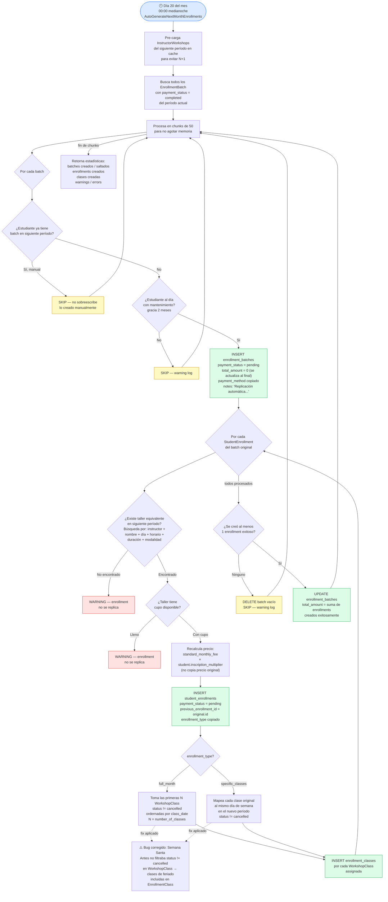

# Historias de Usuario (HU)

> Referencia rápida: menciona el ID (ej. `HU-I02`) para que Claude cargue el contexto completo de esa historia.

---

## HU-I01: Listar Inscripciones

**Rol:** Administrador
**Acción:** Ver un registro de todas las inscripciones realizadas
**Beneficio:** Llevar el control de estudiantes, estados de pago y métodos

### Criterios de aceptación
- [ ] Muestra: estudiante, fecha, estado de pago y método de pago
- [ ] Permite filtrar por periodo mensual, estado de pago, estudiante
- [ ] Permite buscar por nombre de estudiante o código de batch

### Conexión con el código
- Recurso: `EnrollmentBatchResource` → `index` page
- Modelo principal: `EnrollmentBatch`
- Relaciones a eager load: `student`, `studentEnrollments.instructorWorkshop.workshop`

---

## HU-I02: Iniciar Proceso de Inscripción

**Rol:** Administrador
**Acción:** Crear una nueva inscripción seleccionando primero el periodo mensual y luego el estudiante
**Beneficio:** Comenzar el flujo de inscripción correctamente desde el primer paso

### Criterios de aceptación
- [ ] Se debe seleccionar un `MonthlyPeriod` antes de buscar al estudiante
- [ ] El buscador de estudiantes filtra por nombre o código
- [ ] Si el estudiante no tiene mantenimiento al día (grace period: 2 meses), mostrar advertencia o bloquear
- [ ] El formulario avanza en pasos (wizard): Periodo → Estudiante → Talleres → Pago

### Campos del formulario
| Campo | Tipo | Requerido |
|-------|------|-----------|
| Periodo mensual | Select | Sí |
| Estudiante | Search/Select | Sí |

### Reglas de negocio
- Mantenimiento: `Student::maintenance_period_id` debe estar dentro de los últimos 2 meses
- Categorías exentas de esta validación: Vitalicios, Hijo de Fundador, Transitorio Mayor de 75

### Conexión con el código
- Recurso: `EnrollmentBatchResource` → `create` page
- Servicio: `EnrollmentBatchService`
- Validación de mantenimiento: `Student.php` (método de chequeo de maintenance)

---

## HU-I03: Selección de Talleres para Inscripción

**Rol:** Administrador
**Acción:** Ver y seleccionar los talleres disponibles para un estudiante en un periodo dado
**Beneficio:** Inscribir al estudiante en los talleres correctos, incluyendo mantenimiento si aplica

### Criterios de aceptación
- [ ] Lista solo talleres del periodo seleccionado con cupo disponible
- [ ] Muestra si el taller tiene cupo (`isFullForPeriod()`)
- [ ] Muestra el costo calculado según la categoría del estudiante (multiplicador de precio)
- [ ] Permite seleccionar tipo de inscripción: `full_month` (4 clases) o `specific_classes` (recuperación)
- [ ] Indica si el taller está relacionado con mantenimiento mensual

### Reglas de negocio
- Precio base × multiplicador de categoría del estudiante:
  - PRE PAMA 50+: 2.0x
  - PRE PAMA 55+: 1.5x
  - Resto: 1.0x (precio base)
- No se puede inscribir en taller sin cupo

### Conexión con el código
- Modelo: `Workshop`, `InstructorWorkshop`, `StudentEnrollment`
- Capacity check: `Workshop::isFullForPeriod($periodId)`
- Pricing: `Student.php` → métodos de cálculo de precio por categoría

---

## HU-I04: Configurar Detalles de Inscripción

**Rol:** Administrador
**Acción:** Configurar detalles adicionales tras seleccionar los talleres (costos, descuentos, clases específicas)
**Beneficio:** Registrar con precisión los términos de cada inscripción individual

### Criterios de aceptación
- [ ] Permite ajustar número de clases si el tipo es `specific_classes`
- [ ] Muestra subtotal por taller y total del batch
- [ ] Permite aplicar descuentos o ajustes si están configurados
- [ ] El precio final queda guardado en `StudentEnrollment.total_amount` al momento de crear

### Campos relevantes
| Campo | Modelo | Descripción |
|-------|--------|-------------|
| `number_of_classes` | `StudentEnrollment` | Cantidad de clases a tomar |
| `price_per_quantity` | `StudentEnrollment` | Precio unitario por clase |
| `total_amount` | `StudentEnrollment` | Total calculado al momento de inscripción |

### Reglas de negocio
- El precio se congela al momento de crear la inscripción (cambios futuros al taller no afectan enrollments existentes)

### Conexión con el código
- Modelo: `StudentEnrollment`
- Servicio: `EnrollmentBatchService`

---

## HU-I05: Pago y Finalización de Inscripción

**Rol:** Administrador
**Acción:** Registrar el método de pago y estado de la inscripción para finalizar el proceso
**Beneficio:** Que el estudiante quede oficialmente matriculado con su comprobante generado

### Criterios de aceptación
- [ ] Permite registrar pago total o parcial
- [ ] Si es pago parcial: batch pasa a estado `to_pay` (protegido de auto-cancelación)
- [ ] Si es pago total: batch pasa a estado `completed`
- [ ] Se genera un `Ticket` de pago con código único
- [ ] Se registra `payment_registered_by_user_id`

### Estados del EnrollmentBatch

| Estado | Descripción | ¿Se auto-cancela el día 28? |
|---|---|---|
| `pending` | Sin ningún pago registrado | **Sí** → pasa a `refunded` |
| `to_pay` | Pago parcial: al menos un taller pagado pero no todos | **No** → requiere gestión manual |
| `completed` | Todos los talleres del batch pagados | No aplica |
| `credit_favor` | El estudiante tiene saldo a favor | No aplica |
| `refunded` | Cancelado/devuelto (manual o automático) | No aplica |

### Detalle del estado `to_pay` (pago parcial)

Ocurre cuando un estudiante se inscribe en varios talleres y paga solo algunos.

**Ejemplo:** Estudiante inscrito en 3 talleres — paga 2, el tercero queda pendiente.

```
EnrollmentBatch  → to_pay
  ├── StudentEnrollment (Yoga)      → completed  ✅ pagado
  ├── StudentEnrollment (Pintura)   → completed  ✅ pagado
  └── StudentEnrollment (Danzas)   → pending    ⏳ sin pagar
```

**Qué pasa el día 28 con un batch `to_pay`:**
- El batch completo **NO se cancela** (está protegido)
- Solo los `StudentEnrollment` con `payment_status = pending` dentro del batch se cancelan
- El `total_amount` del batch se recalcula con los talleres que quedan activos
- Si los talleres restantes ya estaban pagados, el batch pasa automáticamente a `completed`

**Qué NO hace el sistema automáticamente con `to_pay`:**
- No notifica al estudiante que tiene un saldo pendiente
- No bloquea la inscripción del mes siguiente en la replicación (solo verifica mantenimiento)
- Requiere seguimiento manual por parte de la secretaría

### Flujo de estados del batch

```
Creación
  └── pending (sin pagos)
        ├── pago parcial → to_pay
        │     ├── pago del resto → completed
        │     └── día 28 → inscripciones pending del batch se cancelan
        │                  batch recalcula total → puede pasar a completed
        └── día 28 sin pago → refunded (batch completo cancelado)
```

### Reglas de negocio
- `to_pay` NO se auto-cancela como batch → las inscripciones individuales sin pagar sí se cancelan el día 28
- `pending` SÍ se auto-cancela completo en el día configurado (default: día 28)
- Un batch `to_pay` **sí se replica** al mes siguiente si el estudiante está al día con mantenimiento
- La replicación crea el nuevo batch en `pending`, independientemente del estado parcial anterior

### Conexión con el código
- Acción de pago: `RegisterPaymentAction` en `EnrollmentBatchResource`
- Auto-cancelación: `AutoCancelPendingEnrollments` → métodos `cancelPendingBatches()` y `cancelUnpaidEnrollmentsInPartialBatches()`
- Modelos: `EnrollmentPayment`, `EnrollmentPaymentItem`, `Ticket`
- Servicio de pago: `EnrollmentPaymentService::updateBatchStatus()`

---

## HU-I06: Exportar Inscripciones

**Rol:** Administrador
**Acción:** Exportar la lista de inscripciones a Excel/CSV
**Beneficio:** Generar reportes externos con los datos de inscripciones

### Criterios de aceptación
- [ ] Exporta desde la vista de listado con los filtros activos aplicados
- [ ] Incluye: estudiante, periodo, talleres, monto, estado de pago, método de pago
- [ ] Formato compatible con Excel

### Conexión con el código
- Export class: `EnrollmentBatchExport`
- Librería: Maatwebsite Excel

---

## HU-I07: Replicación Automática de Inscripciones al Siguiente Mes

**Rol:** Sistema (job manual/programado)
**Acción:** Copiar las inscripciones del mes actual al siguiente para los estudiantes con batch `completed`
**Beneficio:** Evitar que la secretaría tenga que re-seleccionar talleres manualmente cada mes; el batch del siguiente mes queda en `pending` listo solo para cobrar

### Qué se replica

| Qué | Estado resultante | Nota |
|-----|------------------|------|
| `EnrollmentBatch` | `pending` | Precio se mantiene del mes original |
| `StudentEnrollment` × N | `pending` | Precio **se recalcula** con tarifas del nuevo período |
| `EnrollmentClass` × M | — | Se asignan a las `WorkshopClass` del nuevo período |

No se replica: pagos, tickets, ni el estado de pago original.

### Criterios de aceptación
- [ ] Solo replica batches con `payment_status = completed` del período actual
- [ ] Salta al estudiante si ya tiene un batch manual en el siguiente período (no sobreescribe)
- [ ] Salta al estudiante si no está al día con mantenimiento (respeta gracia de 2 meses)
- [ ] Si el taller no existe en el siguiente período → warning, no error fatal
- [ ] Si el taller está lleno en el siguiente período → warning, no error fatal
- [ ] **No asigna clases con `status = cancelled`** (feriados, suspensiones)
- [ ] Si ningún taller pudo replicarse → elimina el batch vacío

### Orden de ejecución obligatorio

| Paso | Día | Quién | Qué |
|------|-----|-------|-----|
| 1 | Día 19 — 23:59 | Sistema | `enrollments:auto-cancel` → cancela batches `pending` de Mayo (sin pago al límite) |
| 2 | Día 20 — 00:00 | Sistema | `workshops:auto-replicate` → crea talleres y `workshop_classes` de Junio (todas en `scheduled`) |
| 3 | Días 20-21 | Admin | Revisa el calendario de Junio y marca feriados/suspensiones como `cancelled` |
| 4 | Día 22 — 00:00 | Sistema | `enrollments:auto-generate` → crea batches `pending` para Junio asignando solo clases `scheduled` |

> **Crítico:** `enrollments:auto-cancel` debe correr **antes** de `enrollments:auto-generate`.
> El auto-cancel no filtraba por período y cancelaría los batches de Junio recién creados.
> Fix aplicado: `AutoCancelPendingEnrollments` ahora filtra `monthly_period_id <= currentPeriod`.

### Configuración en SystemSettings

| Setting | Valor recomendado | Descripción |
|---------|------------------|-------------|
| `auto_cancel_day` | `19` | Día del mes que corre `enrollments:auto-cancel` |
| `auto_cancel_time` | `23:59:00` | Hora exacta |
| `auto_generate_day` | `20` | Día del mes que corre `workshops:auto-replicate` |
| `auto_generate_time` | `00:00:00` | Hora exacta |
| `auto_replicate_enrollments_day` | `22` | Día del mes que corre `enrollments:auto-generate` |
| `auto_replicate_enrollments_time` | `00:00:00` | Hora exacta |

### Diagrama de cronograma mensual

```mermaid
timeline
    title Ciclo de replicación mensual (ejemplo: Mayo → Junio)
    Día 19 - 23:59 : enrollments:auto-cancel
                   : Cancela batches pending de Mayo
                   : Solo períodos actuales o anteriores
                   : Los batches de Junio quedan protegidos
    Día 20 - 00:00 : workshops:auto-replicate
                   : Clona talleres de Mayo → Junio
                   : Genera WorkshopClasses para Junio
                   : Todas inician en status = scheduled
    Días 20 y 21   : Admin revisa calendario de Junio
                   : Marca feriados como cancelled
                   : Ej. Viernes Santo, feriados nacionales
    Día 22 - 00:00 : enrollments:auto-generate
                   : Lee batches completed de Mayo
                   : Crea batches pending para Junio
                   : Solo asigna clases scheduled
                   : Ignora las cancelled
```

### Bug documentado: Semana Santa

**Fecha:** Corrida manual durante periodo de Semana Santa  
**Síntoma:** Inscripciones (EnrollmentClass) generadas apuntando a Viernes y Sábado Santo  
**Causa raíz:** `createDefaultEnrollmentClasses()` y `findEquivalentWorkshopClass()` en
`EnrollmentReplicationService` no filtraban `workshop_classes` con `status = 'cancelled'`  
**Fix aplicado:** Agregar `->where('status', '!=', 'cancelled')` en ambas consultas

```php
// createDefaultEnrollmentClasses() — línea ~400
WorkshopClass::where('workshop_id', ...)
    ->where('monthly_period_id', $period->id)
    ->where('status', '!=', 'cancelled')   // ← fix
    ->orderBy('class_date', 'asc')
    ->limit($enrollment->number_of_classes)

// findEquivalentWorkshopClass() — línea ~381
WorkshopClass::where('workshop_id', $newWorkshop->id)
    ->where('monthly_period_id', $nextPeriod->id)
    ->where('status', '!=', 'cancelled')   // ← fix
    ->whereRaw('DAYOFWEEK(class_date) - 1 = ?', [$originalWeekday])
```

### Conexión con el código
- Servicio: `app/Services/EnrollmentReplicationService.php`
- Depende de: `app/Services/WorkshopReplicationService.php` (debe correr primero)
- Comando: `app/Console/Commands/AutoGenerateNextMonthEnrollments.php` (actualmente deshabilitado en scheduler)
- Modelos: `EnrollmentBatch`, `StudentEnrollment`, `EnrollmentClass`, `WorkshopClass`

---

### Diagrama del Job enrollments:auto-generate (día 22 a medianoche)



### Diagrama de casos con inscripciones

```

flowchart TD

%% ENTRY POINTS
NAV([Usuario accede Gestión -> Inscripciones])
CRON([Scheduler cada minuto])

%% LIST PAGE
LIST[ListEnrollmentBatches Tabla principal]
FILTERS[Filtros Usuario Estado Metodo Mes]

NAV --> LIST
LIST --> FILTERS

%% CREATE FLOW
LIST -->|Nueva Inscripcion| CREATE_REDIRECT[CreateEnrollmentBatch redirige a EnrollmentResource create]
CREATE_REDIRECT --> WIZARD

subgraph WIZARD [Wizard 3 pasos]
W1[Paso 1 Seleccionar periodo estudiante talleres]
W2[Paso 2 Configurar detalles cantidad clases]
W3[Paso 3 Resumen precios metodo pago]
W1 --> W2 --> W3
end

W3 -->|Finalizar| DB_CREATE

subgraph DB_CREATE [Insert BD]
EB1[enrollment_batches status pending]
SE1[student_enrollments uno por taller]
EB1 --> SE1
end

DB_CREATE --> LIST

%% VER TICKETS
LIST -->|Ver Tickets| MODAL_TICKETS[Modal lista tickets]
MODAL_TICKETS --> TICKET_PDF[ticket id pdf descarga]

%% REGISTRAR PAGO
LIST -->|Pago si status distinto completed| PAGO_CHECK{Metodo de pago}

PAGO_CHECK -->|link| PAGO_LINK[Formulario voucher fecha]
PAGO_CHECK -->|cash| PAGO_CASH[Formulario talleres monto]

PAGO_LINK --> SVC_PAY
PAGO_CASH --> SVC_PAY

subgraph SVC_PAY [EnrollmentPaymentService processPayment]
P1[Insert enrollment_payments]
P2[Update student_enrollments status completed]
P3[Insert tickets]
P4[updateBatchStatus recalcula estado]
P1 --> P2 --> P3 --> P4
end

P4 -->|completed| STATUS_COMP[Batch status completed]
P4 -->|parcial| STATUS_TOPAY[Batch status to_pay]

%% ANULAR
LIST -->|Anular autorizado| ANULAR_CONFIRM[Modal confirmacion motivo]
ANULAR_CONFIRM --> DB_ANULAR

subgraph DB_ANULAR [Update BD anular completo]
A1[Batch status refunded]
A2[student_enrollments refunded]
A3[tickets cancelled]
A1 --> A2 --> A3
end

%% ANULAR PENDIENTES
LIST -->|Anular pendientes| ANULAR_PEND[Modal seleccionar talleres]
ANULAR_PEND --> DB_PEND

subgraph DB_PEND [Update BD parcial]
B1[student_enrollments refunded]
B2[recalcula total_amount]
B3[updateBatchStatus]
B1 --> B2 --> B3
end

%% MOTIVO
LIST -->|Motivo| MODAL_MOTIVO[Modal detalle anulacion]

%% EDITAR
LIST -->|Editar pending| EDIT_REDIRECT[Wizard con datos precargados]
EDIT_REDIRECT --> WIZARD

%% CRON
CRON --> CRON_CHECK{Es hora programada}

CRON_CHECK -->|No| CRON_SKIP[No hace nada]
CRON_CHECK -->|Si| CRON_PENDING

subgraph CRON_PENDING [AutoCancelPendingEnrollments]
C1[Busca batches pending]
C2[Update refunded cancelled_by sistema]
C3[Cancela tickets activos]
C1 --> C2 --> C3
C4[Batches to_pay requieren gestion manual]
end

%% EXPORT
LIST -->|Exportar Excel| EXPORT[Descarga xlsx]

````